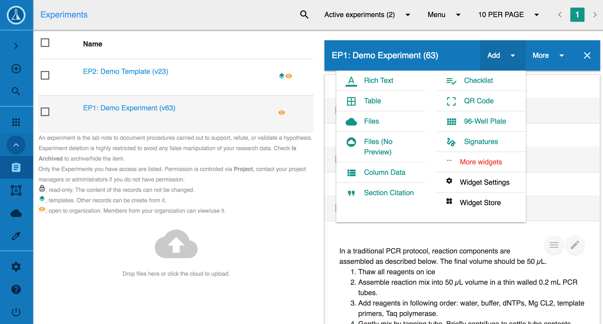

# Introduction

Labii helps scientists from biotech and pharmaceutical companies **document**, **manage** and **interpret** research data with **electronic lab notebook \(ELN\)** and **laboratory information management system \(LIMS\)**.

**Labii ELN & LIMS** is an online platform and is available at [https://www.labii.com/](https://www.labii.com/).

There are 3 versions of Labii ELN & LIMS, this documentation covers the guidelines for [Labii ELN & LIMS \(v3\)](https://v3.labii.com) and [Labii API](https://api.labii.com).

## [Quick Start](quick-start.md)

Click the [link](quick-start.md) to navigate to quick start. 

## Features

See a list of Labii features at [https://www.labii.com/features/](https://www.labii.com/features/)

## Help and Support

* Email or join google group help@labii.com.
* [Submit a Support Ticket](./)

## Links

* [Labii ELN & LIMS Home Page](https://www.labii.com/)
* [Labii ELN & LIMS \(v2\)](https://v2.labii.com/)
* [Labii ELN & LIMS \(v3\)](https://v3.labii.com/)
* [News & Blog](https://blog.labii.com/)
* [Contact Us](https://www.labii.com/contact-us/)
* [Jobs](https://angel.co/labii/jobs)

