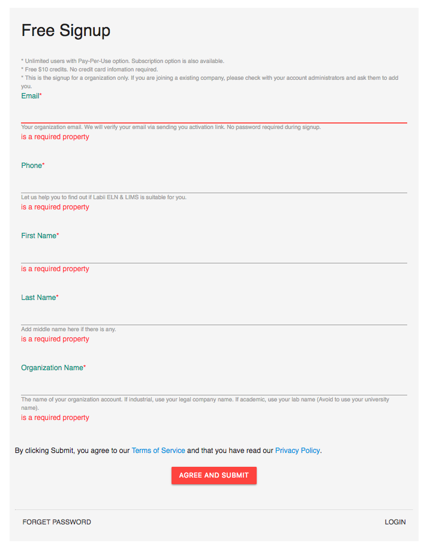
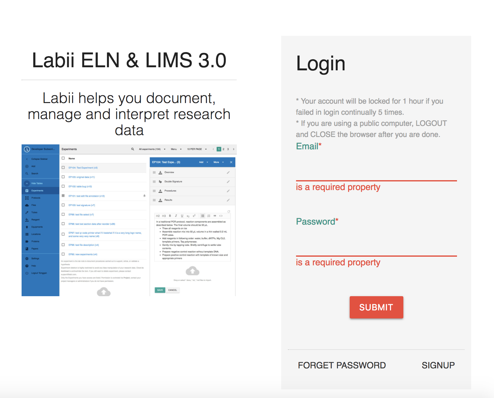
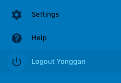
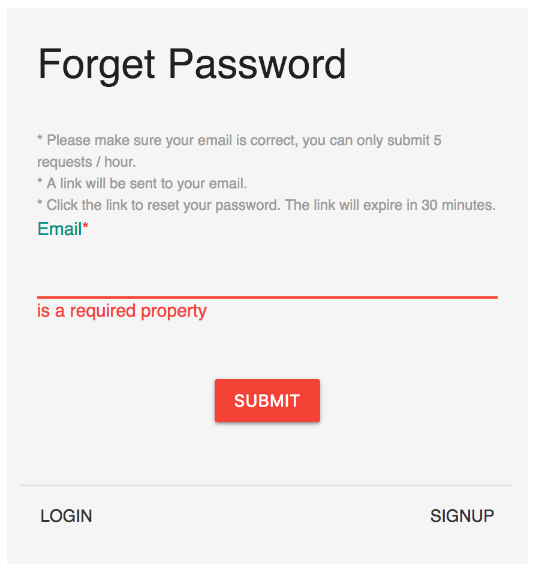
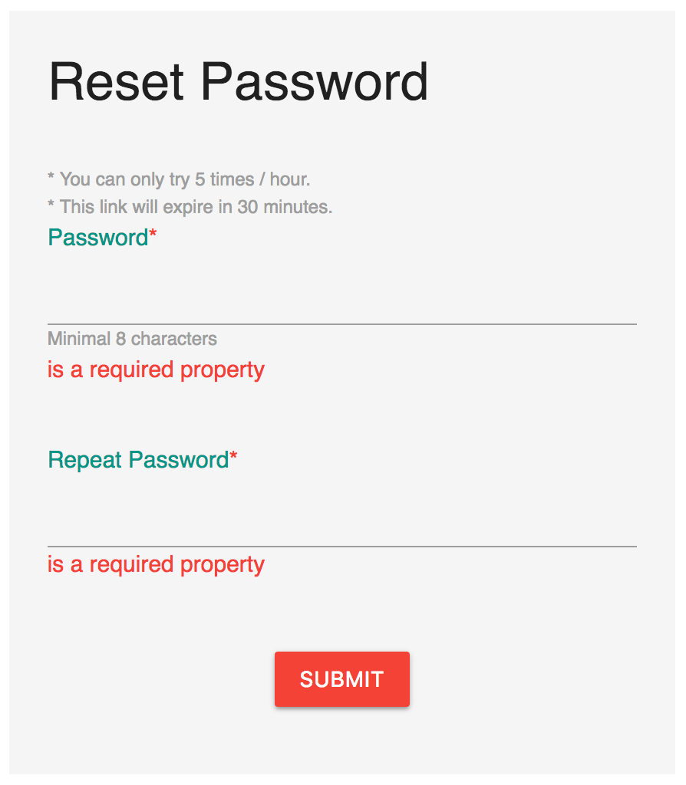

# Authentication

## Sign up

Use [sign up page](https://v3.labii.com/accounts/signup/) to create a new organization at Labii \([https://v3.labii.com/accounts/signup/](https://v3.labii.com/accounts/signup/)\).

An organization at Labii represents a biotech/pharmaceutical company, an academic lab, department or university. An organization is the customer of Labii and the entirety responsible for the cost that generated in using Labii platform or licensing Labii code or technology.

One company can create one or more Organizations at labii.com. One same email can be added to multiple organizations. Each organization is an individual account and is responsible for the cost of all its users \(In other words, if a email is added to two different organizations, both organizations have to pay for the users subscription fee or pay per use fee\). Please note the data can not be shared between two organizations.

> **STOP:** If you are joining an existing company, please check with your account administrators and ask them to add you.

### Free trial

* It is **FREE** to sign up.
* **$10** credits will be provided.
* No Password required.

### Steps

Fill all fields and click **AGREE AND SUBMIT** to create an organization. By clicking Submit, you agree to our [Terms of Service](http://www.labii.com/terms-of-service/) and that you have read our [Privacy Policy](https://www.labii.com/privacy-policy/).

* Email
* Phone
* First Name
* Last Name
* Organization Name

### What to expect

Once submitted. You shall receive two emails from support@labii.com. Check your spam and unspam the emails if you did not see the emails.

* **Activate Your Account**: This email indicates your account at labii.com has been created. Please follow the instruction to _activate your account_ and _set up your password_. Your need to activate your account first to verify your email is correct.
* **Your account at \[Your Organization Name\]**: This email indicates you have been added to the organization. A link of the organization home page is included.

> **IMPORTANT:** The Link to set up your password will expire in 30 minutes. If expired, use [Forget Password](https://v3.labii.com/accounts/forgetpassword/) to reset your password.

## Login

To log on to Labii, visit https://v3.labii.com and enter your **Email** and **Password** in the corresponding boxes and click **Submit.**


Your account will be locked for 1 hour if you failed in login continually 5 times. 



You will receive an email regarding each of your failed login. 


## Sign out

To sign out of Labii, click the **"Logout \[your name\]"** button on the bottom of the left sidebar, below the Help button.

## Forget password

Use this documentation to change/update your password.

For the security reasons, the reset password you received will be invalid after 30 minutes. In that case, you need to use **Forget Password** function to get a new link.


Before proceed, please make sure you have followed the **Welcome Email** from Labii to activate your account. If your account is not activated, you will never able to login.

If you did not receive such email, please double check your spam, or double check with your administrators, they might add a wrong email address.


To use Forget Password, you can visit this link \([https://v3.labii.com/accounts/forgetpassword/](https://v3.labii.com/accounts/forgetpassword/)\) or click the **Forget Password** button at the Labii 3 login page \([https://v3.labii.com/](https://v3.labii.com/)\).

Provide your email address and click Submit, you shall receive a email from Labii Support \(support@labii.com\) within 2 minutes. Click the link in the email to reset your password.

Once new password is provided, you shall able to login with new password.


Please make sure you clicked the RESET PASSWORD link within 30 minutes. For the security reasons, the link will be expired in 30 minutes.


