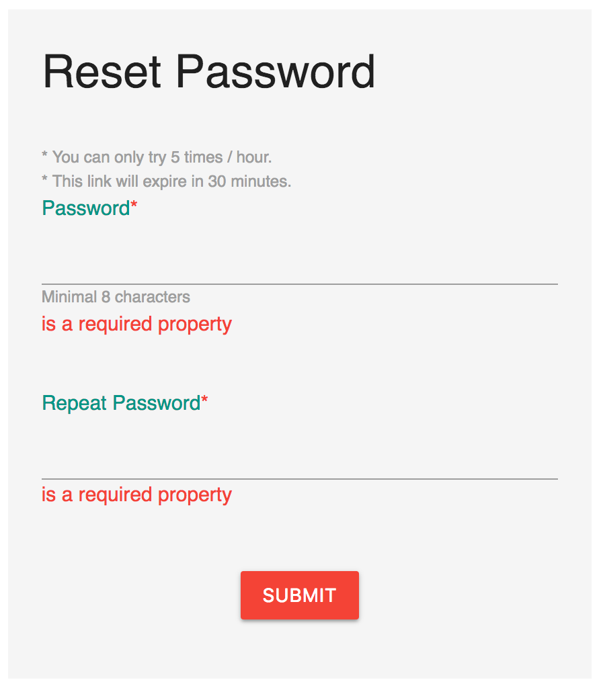

# Forget password

Use this documentation to change/update your password.

For the security reasons, the reset password you received will be invalid after 30 minutes. In that case, you need to use **Forget Password** function to get a new link.


Before proceed, please make sure you have followed the **Welcome Email** from Labii to activate your account. If your account is not activated, you will never able to login. 

If you did not receive such email, please double check your spam, or double check with your administrators, they might add a wrong email address.


To use Forget Password, you can visit this link \([https://v3.labii.com/accounts/forgetpassword/](https://v3.labii.com/accounts/forgetpassword/)\) or click the **Forget Password** button at the Labii 3 login page \([https://v3.labii.com/](https://v3.labii.com/)\).

Provide your email address and click Submit, you shall receive a email from Labii Support \(support@labii.com\) within 2 minutes. Click the link in the email to reset your password.

Once new password is provided, you shall able to login with new password.


Please make sure you clicked the RESET PASSWORD link within 30 minutes. For the security reasons, the link will be expired in 30 minutes.


