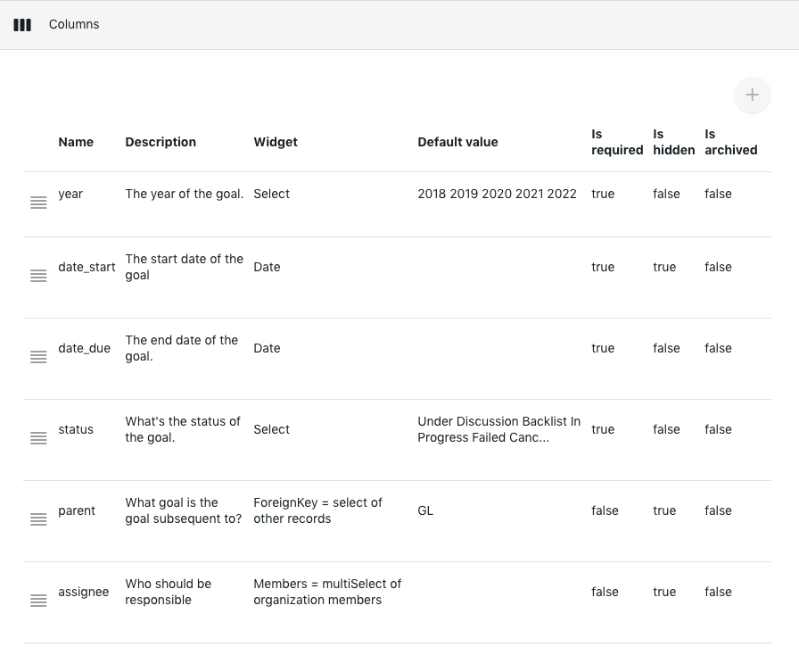
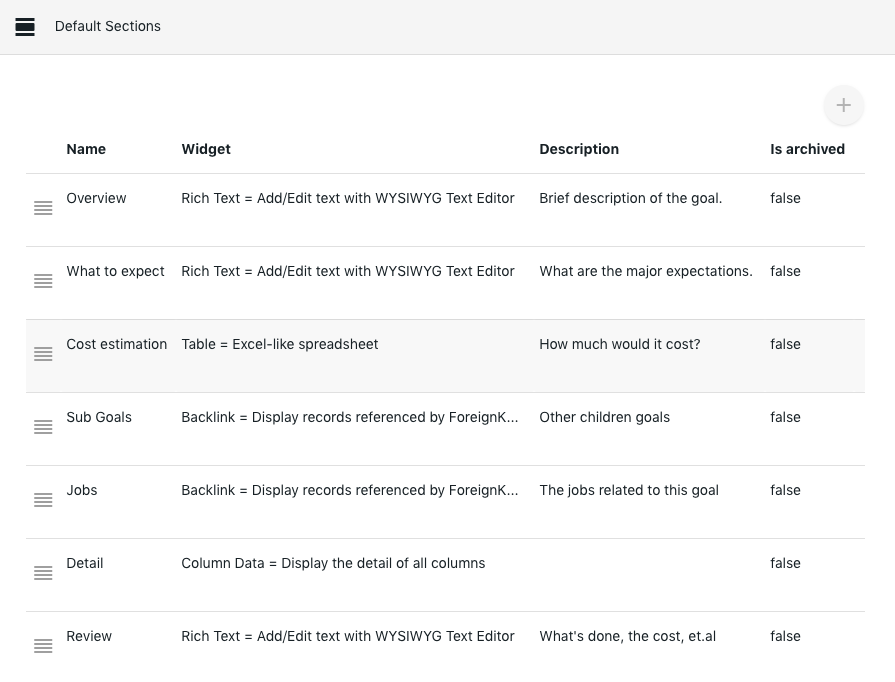

# Goal management

## Overview

With [Labii ELN and LIMS](https://www.labii.com) you will be able to conveniently manage your research goal. You’ll also be able to categorize each experiment note according to your research goal. For the yearly review, Labii application makes it easy to carry out review all that you did the previous and current years. It also enables you to input your plans for the coming year.   

## Before start

Before getting started, the following widgets are required and they must be activated prior to use.  [Click here to learn how to activate or deactivate a widget. ](../settings/widgets.md)

* [Rich Text](../widgets/text.md)
* [Table](../widgets/table.md)
* [Backlink](../widgets/foreign-key-relationships.md)


Note: Only the administrators will be permitted to make changes.


## Configuration

### 1\) [Create a table](../settings/tables.md#add-a-table) named **goals**:

> Table Name \(Singular\) = goal  
> Table Name \(Plural\) = goals  
> Description = Research goals  
> Unique Code = GL  
> Icon = adjust  
> Type = Substance

### 2\) [Create the following **columns**](../settings/tables.md#customize-column) for the table **goals:**

1. **year**, The year the research goal commenced
2. **date\_start**, This shows the commencement date of the goal
3. **date\_end**, The date the goal was completed
4. **status**, shows the current status of the goal
5. **parent**, This column is used to create a bigger goal consisting of many more detailed small goals
6. **assignee**, shows the person responsible for the goal

Default value for the year \(the value can be updated later, please keep one value at one line\):

* 2018
* 2019
* 2020
* 2021
* 2022

Default value for the status \(the value can be updated later, please keep one value at one line\):

* Under Discussion
* Backlist
* In Progress
* Failed
* Canceled
* Completed

### 3\) [Create the following **sections**](../settings/tables.md#customize-default-sections):

1. **Overview**, To give a brief description of the goal
2. **What to expect**, This is where you indicate the proposed outcome of the goal
3. **Cost estimation**, The total cost estimation that would be enough to accomplish the goal should be stated in this section.
4. **Sub Goals**, All other related goals should be stated here
5. **Jobs**, The jobs related to this goal are indicated in this section. This section can be changed to `experiments`, `protocols`, et.al.
6. **Detail**, This shows the column value of the goal
7. **Review**, This section is where the year-end review of the goal is clearly stated. How much work has been done, the cost etc are all indicated in the review section.

### 4\) Add ForeignKey relationship to the goal:

You need to first add a **ForeignKey** column in the table of experiments in order to link experiment notes with goals. This is then followed by selecting a goal you created each time an experiment note is created.

### 5\) Year-end Review:

The annual review of your goals should be carried out. The review should specifically describe what has been done, what need to be improved upon and the actually cost of the goal. You must not also forget to update the status of the goal.

