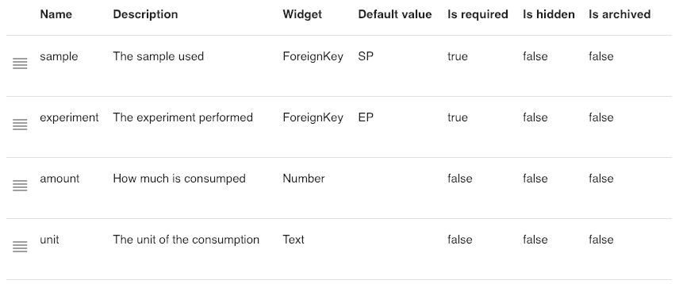

# Track sample consumption

## Overview

Sample consumption is a record of sample or reagent usage in a biotech laboratory. To meet the requirement of GLP \(Good Laboratory Practice\) and FDA 21 FR Part 11, the sample consumption shall always be captured and recorded when performing a scientific experiment. On one hand, the record can guide other scientists to follow and reproduce the result. On the other hand, these records are critical to finding the problems if anything goes wrong. 

Sample consumption tracking is challenging in ELN \(Electronic Lab Notebook\) and LIMS \(Laboratory Information Management System\). It requires the functionalities of both ELN and LIMS. All samples and reagent are stored in the LIMS, however, the act of consumption happens during the experimentation process. As such, this functionality is not available for almost all ELN or LIMS product in the market. 

Labii ELN & LIMS has stepped in to combine the data management for both ELN and LIMS in one online repository. With the flexibility of data storage and extensibility of functionalities in Labii ELN & LIMS, the tracking of sample consumption is now possible and easy to document. 

This documentation covers the necessary steps to configure your Labii ELN & LIMS account to store the sample consumption details.

## Requirement

Before started, there is a few configuration required from your administrators. 

### Tables

The following 3 tables need to be created \(Please check here for how to create tables\):

* **Experiments**. A table to keep a list of experiment notes.
* **Samples**. A table to keep a list of samples.
* **Consumptions**. A table to keep tracking of consumption details. 


Additional tables like **Reagents** can be created to track the consumption of the reagents.


### Columns

No specific fields required for the **Experiments** and **Samples** tables. While for the **Consumption** table, these fields need to be added:

* **experiment**, the experiment id
* **sample**, the sample id
* **amount**, how much is used
* **unit**, the unit of consumption

Please follow the picture below to choose the widget and default value


Do not set default value for **sample** column if you want to tracking the consumption for other tables as well.

Separate the Unique Code with "," for the default value if you want to tracking the consumption for multiple tables. For example, use "SP,RG" to tracking both samples and reagents.


### Sections

Now, the columns in the **Consumption** table creates all necessary links between experiments and samples. The details of consumption can be displayed in an experiment or a sample with [Backlink](../widgets/foreign-key-relationships.md#backlink) widget. 

#### Add consumption to an experiment:

[Add a section named "**Sample Consumption**" with widget **Backlink**.](../eln-and-lims/detail-view.md#add-section) This widget allows you to display the consumption of each sample, add and edit the consumption details. Click the _edit_ icon to configure the backlink:

| Field | Value |
| :--- | :--- |
| Table | consumption |
| Column | experiment |
| Fields | sample, amount, unit |

Please see the [Backlink documentation](../widgets/foreign-key-relationships.md#backlink) for more detail on the configuration.

#### Add consumption to a sample:

If you want to look back on how many experiments is using the sample, [add a section named "Consumption" with widget Backlink](../widgets/foreign-key-relationships.md#backlink). Click the _edit_ icon to configure the backlink:

| Field | Value |
| :--- | :--- |
| Table | consumption |
| Column | sample |
| Fields | experiment, amount, unit |

Please see the [Backlink documentation](../widgets/foreign-key-relationships.md#backlink) for more detail on the configuration.


Please note you can [save the above configuration to avoid duplicate work](../eln-and-lims/detail-view.md#save-default-section-data).


## Tracking consumption

With the above configuration, the consumption can be view at two different levels. The experiment level to see how much samples is used for one particular experiment, and the sample level to track how many experiments is using this sample.

### Experiment level

The list of samples and how much was used can be displayed at the experiment level, to do that:

1. [Add an experiment](../eln-and-lims/add-record.md#add-a-record)
2. [Add a section "Sample Consumption" as described above](track-sample-consumption.md#sections), configure the Backlink if necessary
3. Click the "New Consumption" button to add a new consumption
4. Continually add more consumptions till all samples are covered
5. Mouse over to a consumption to update the details of the consumption

### Sample level

The list of experiments that used a sample can be displayed at the sample level, to do that:

1. [Add an sample](../eln-and-lims/add-record.md#add-a-record)
2. [Add a section "Consumption" as described above](track-sample-consumption.md#sections), configure the Backlink if necessary
3. Click the "New Consumption" button to add a new consumption \(optional\)
4. Mouse over to a consumption to update the details of the consumption

