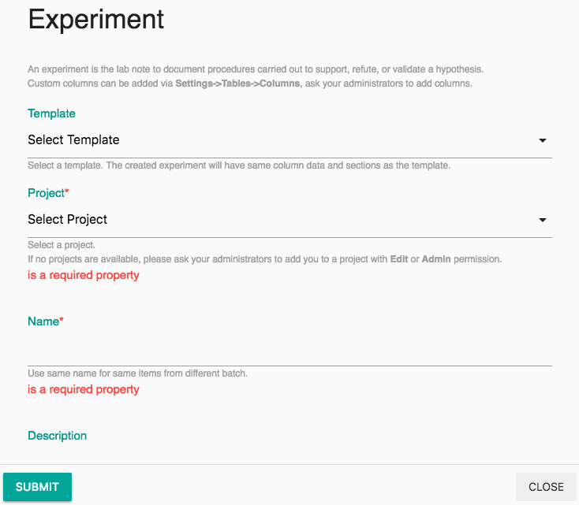
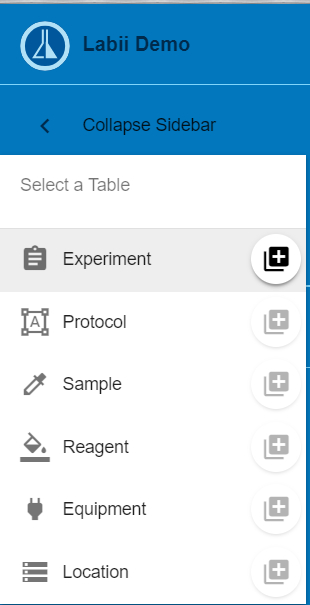
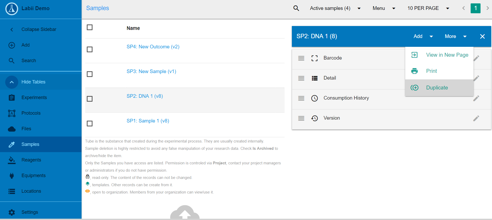

# Add Record

## Add a Record

A record refer to an experiment, a protocol, a file, et.al in [Labii Electronic Lab Notebook \(ELN\) and Laboratory Information Management System \(LIMS\)](https://www.labii.com). Following the steps to create an experiment, protocol, et.al:

1. Click the **Add** button in the sidebar.
2. Select a table name in the dropdown.
3. Fill in the form and click **Submit**.

All the steps is identical to the [Quick Start](../quick-start.md).

## Add Record from a Template

To create an records that is similar to existing ones, use the **Add from template** function. Any records can be set as template vis set `is_template=true`. To add a record from a existing template:

1. Click the **Add** button from the sidebar.
2. Click the **"+"** icon next to the table name you are adding. 
3. Search for or select a template. 
4. The form will pre-filled with the value from the template.
5. Click **Submit** to submit.


Record creates from a template will have same column data and sections as the template, but the section data will be empty.


## Duplicate From Existing Record

To create an record that is identical to the existing one, use **Duplicate** function. 

1. Click on the table name you have an existing record of in the sidebar. 
2. Click on the record name you want to duplicate and a panel should open on the right. 
3. Select the **More** button on the top right corner. 
4. Click **Duplicate** from the drop down menu. 


The duplicated records will have exact same column data and sections as the template.


