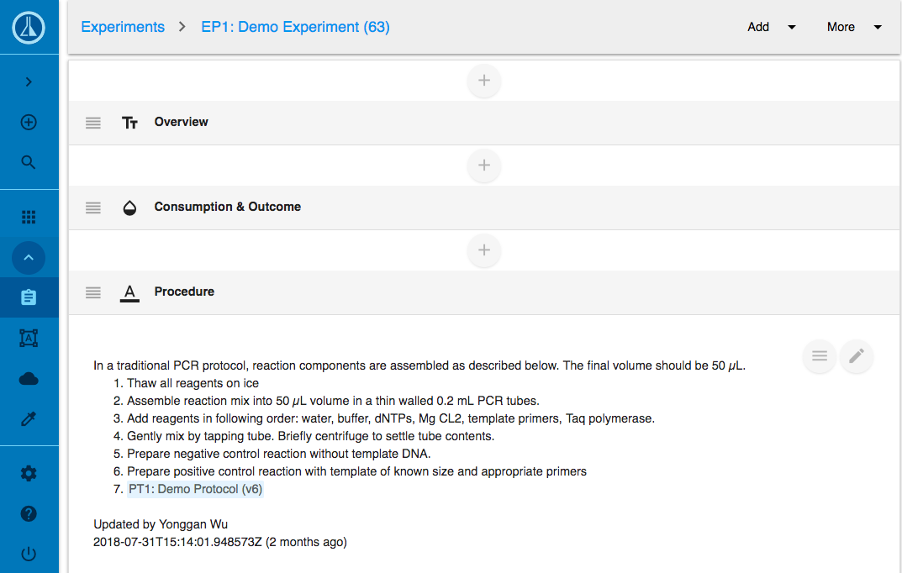
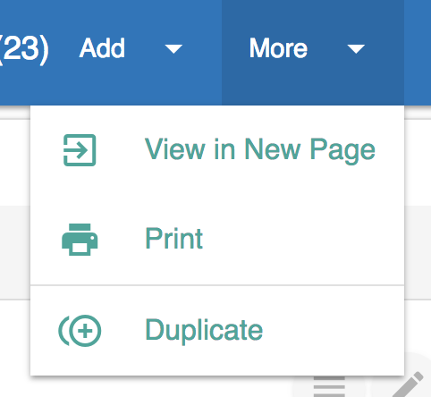

# Detail View

## Overview

The detail view of a record display the content of the record. This function is mostly used in Electronic Lab Notebook \(ELN\) to define the detail of a processing experiment. It can also used in the Laboratory Information Management System \(LIMS\) to record the detail of a record.

In [Labii ELN & LIMS](https://www.labii.com), the detail view is build up with a collection of sections. Each section holds certain data of the record, and use a specific widget to display and edit the content. For example, a summary section might holds the basic summary of an experiment, and the summary can be updated with a [Rich Text]() widget.

## Open Detail View

## Add Section

To add a section:

1. Click the **Add** menu
2. In the dropdown, select a widget
3. If the widget is not in the link, click **More Widgets** to browse more widgets
4. To manage your widgets, click **Widget Settings.** 
5. To purchase more widgets, click **Widget Store.** 

Click on the widgets' title names to expand and close the descriptions.

To see Detailed View of the widgets in a **new page**, **print** or **duplicate** your experiment, click **More** and then the corresponding option.

