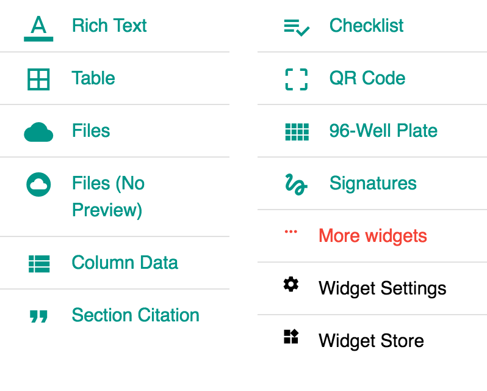
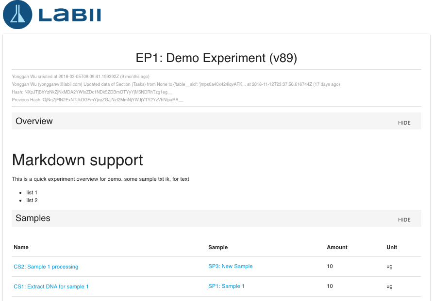

# Detail View

## Overview

The detail view of a record display the content of the record. This function is mostly used in Electronic Lab Notebook \(ELN\) to define the detail of a processing experiment. It can also used in the Laboratory Information Management System \(LIMS\) to record the detail of a record.

In [Labii ELN & LIMS](https://www.labii.com), the detail view is build up with a collection of sections. Each section holds certain data of the record, and use a specific widget to display and edit the content. For example, a summary section might holds the basic summary of an experiment, and the summary can be updated with a [Rich Text](../widgets/text.md#rich-text) widget.

## Open detail view

The detail view can be open via clicking the name of a record. 

To get full page view of the detail:

* Click the "**Title**" of the record at the split view.
* **More -&gt; View in new page** at the split view.

## Add section

To add a section:

1. Click the **Add** menu
2. In the dropdown, select a widget
3. If the widget is not in the link, click **More Widgets** to browse more widgets
4. If a widget is not allowed to use, click **Widget Store** to active the widget. \(Note: Only administrator can perform\)
5. Once added, click edit icon to update the value of the section.

## Edit section

### Edit section name

Click more icon and select Change Section to edit the section. The name and description of the section can be updated.

### Edit section content

Click the edit icon or "**Edit Content**" in the dropdown menu to update the content of the section. Based on what widget the section is using, the interface will various a lot. The usage of each widget can be found in the [Widget](../settings/widgets.md). 

### Reset section content

Click the "**Reset Content**" to reset the content of the section. This can be used when duplicating from an existing record and the content of the section need to be cleaned.

### Save default section data

To avoid configuring certain widgets for all new records, the default value of a section can be saved and re-used. Once the default section value is saved, the value will be loaded automatically when save section is created.

The data saved are specific to the **Table**, **Widget** and **Section Name**. 

Labii provides 3 levels of default data:

1. **Personal level \(Save as my default\)**, for your personal preference.
2. **Project level \(Save as project default\)**, specific to a project.
3. **Organization level \(Save as organization default\)**, specific to your organization.

The data will be used in order. If the personal default data is saved, it will be used first. If the personal default data is not available, then the project default data will be used. If both personal default data and project default data are not available, then the organization default data will be used.


Only the project managers can save the project default data.

Only the administrators can save the organization default data.


**Usage:**

If you need to set up the signers for all of your experiments, save the settings of authors, witness, et.al at your personal level. Then the same configuration will be added automatically.

1. Create a section named "**Signatures**", choose widget "**Signatures**".
2. Add the authors and witnesses.
3. Click "**Save as my default**"
4. In the new experiment, when you create a section "Signatures" with widget "Signatures", the same settings will be added directly.

### Refresh section

If, for some reason, the content of the section is not up-to-date. Click **Refresh Section** to reload the data.

### Archive section

To discard or hide the section, click Archive Section to hide the section.

### Collapse content

The content of the section can be collapse and expand via clicking section header.

### Change order

The order of section can be change via dragging the section header.

## Print

The detail of the record can be print out. More -&gt; Print.


Section can be hidden from printing via click the **HIDE** button.


## Duplicate

Check [here](add-record.md#duplicate-from-existing-record) for more detail.

## Sign the record

All records can be signed via [Signature](../widgets/signature.md) widget. Once signed, the document is locked from editing. However, the read-only widget can still been added to display the data of the records.

