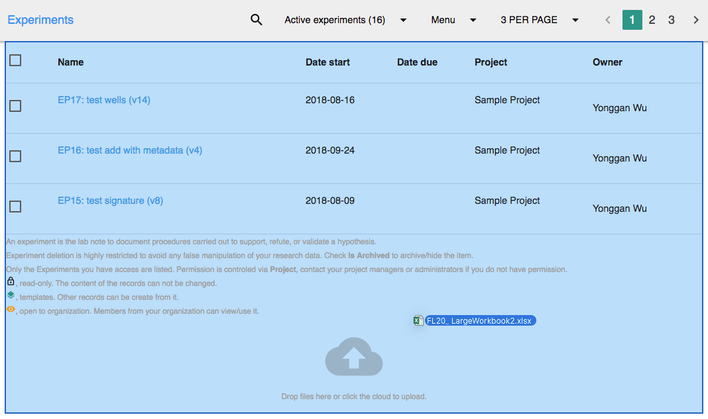
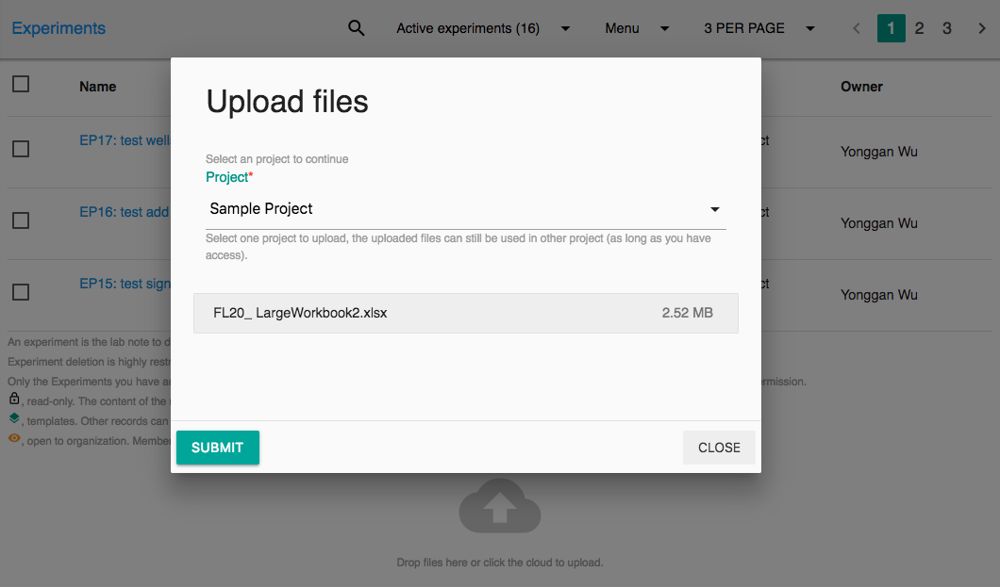
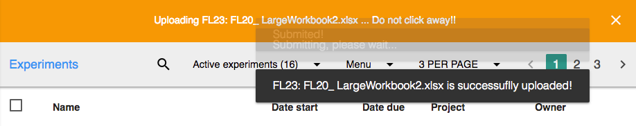

# Document Management

## About

As a Electronic Lab Notebook \(ELN\) and Laboratory Information Management System \(LIMS\), Labii also manage all your files in a **Files** Table. 

This table is created by system, you can not archive this table. However, you can still customize it to change the name/icon, et.al. On default, the Files table using **FL** as unique code. 

Similar to other records, File record can NOT be deleted. Please archive the files if you do not want to use them. 

## Upload Files

Files can be uploaded at any [list view](list-view.md) in [Labii ELN & LIMS](https://www.labii.com). Both Drag-and-Drop and Manual upload are supported. Labii also supports uploading multiple files at the same time.

The largest object that can be uploaded in a single PUT is 5 gigabytes. [For objects larger than 100 megabytes, customers should consider using the Multipart Upload capability.](https://aws.amazon.com/s3/faqs/) Please contact help@labii.com if you have problem in uploading big files.

To upload one or many files. Click the cloud icon or drag and drop files to the list area. See the highlighted area bellow:

Once dropped, you will be popped to to select a project to upload. Files uploaded to Labii is permission controlled, only the users from your project can view/use the files. 


Make sure your the length of your file name is less than 500 characteristics. 



Please **DO NOT** include any special characters in your file name. For example: **\#.** _Labii will remove these special characters. Please do not surprised if your file name is different to your original ones._


Once chose, click Submit to upload files. The files uploading status will be available in the Nav bar. **DO NOT CLICK AWAY**, wait till the notification bar disappeared and the bubble said the file is successfully uploaded.


If you click away or close the window during the file uploading, you are interrupting the file uploading process. 


## Files Table

Files table is same as all other tables. Click the table to view a list of files that uploaded.

## Widgets

Files can be inserted into any records with the widget of [**Files**](../widgets/file.md) or [**Files \(No Preview\)**](). Preview is available for text files, office files, pdf files. Files can also been downloaded directly from these widgets. New files can be uploaded directly in the widgets. Please see the widgets for more details.

