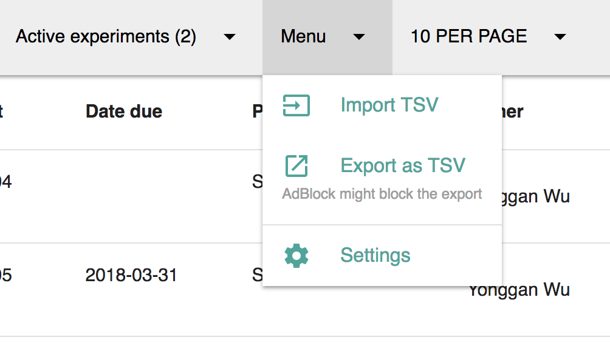
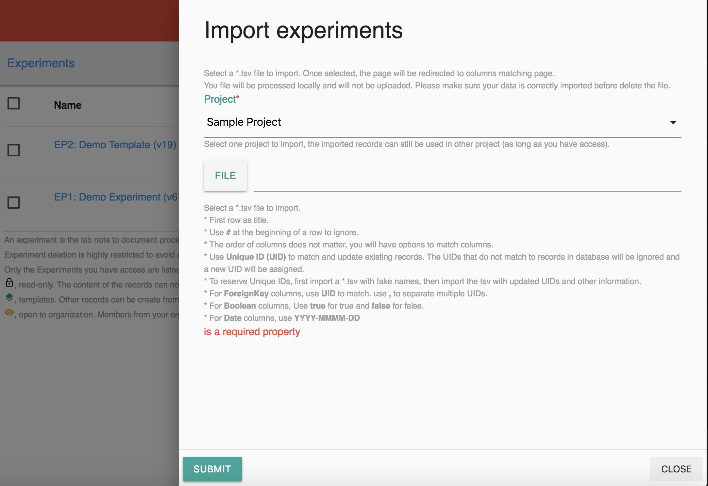
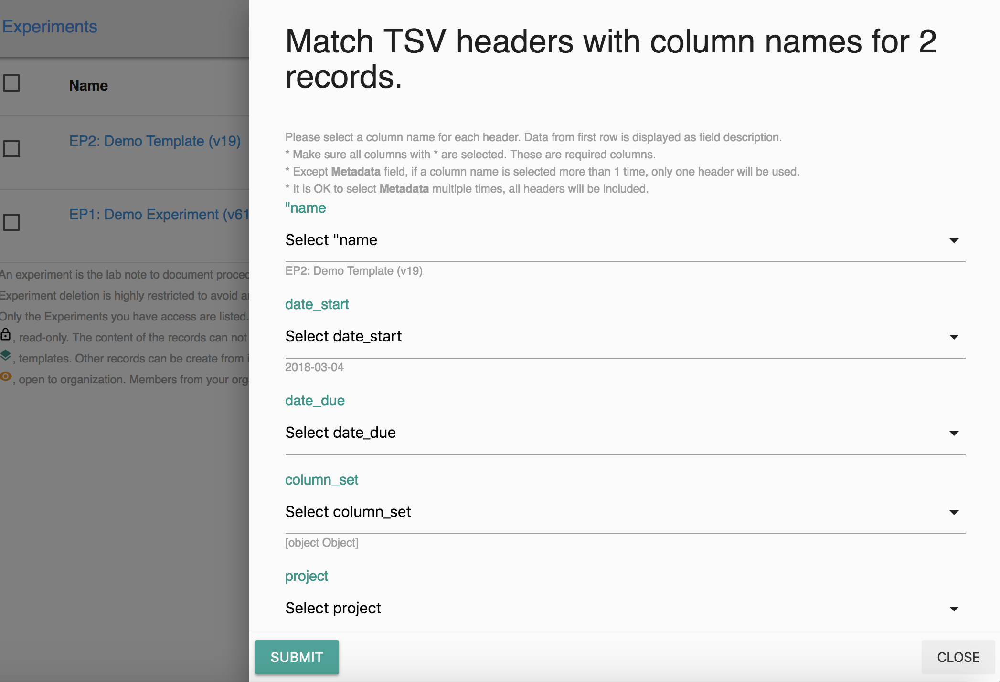
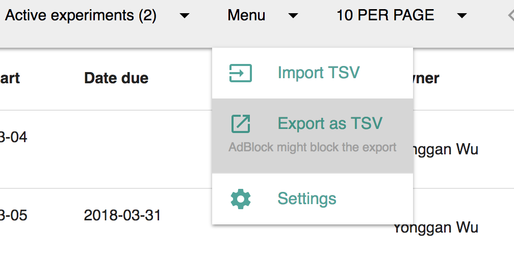

# Import and Export

## Import

To import projects,

1. Select a table category from the sidebar.
2. Click the **Menu** button on the top bar and click **Import**.
3. Choose which project to import from the drop-down list. 
4. Upload your \*.tsv file.
5. Choose the columns to match with each header for your records. 
6. Click **Submit**.

## Export

Click the **Menu** drop-down list and click **Export as TSV**. The files will download on your computer. 

