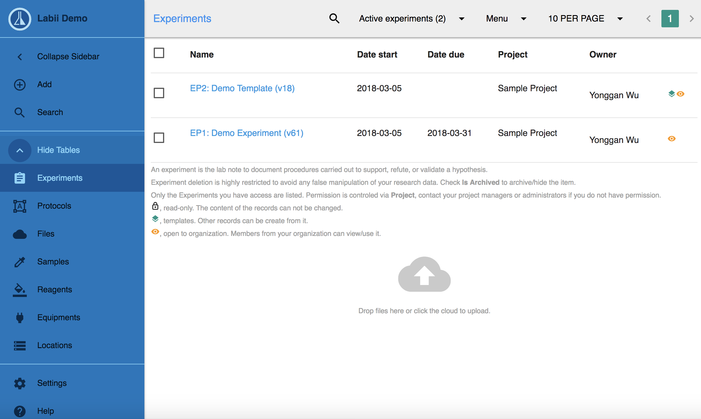
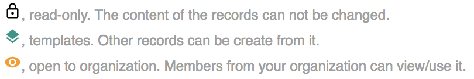
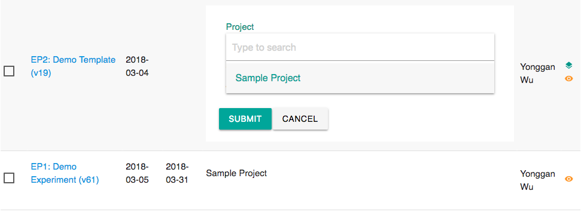
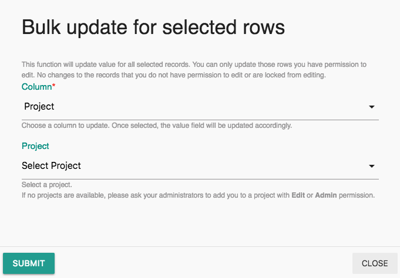
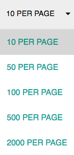
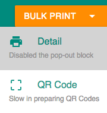

# List View

## Layout

The list view showing a list of records. It contains a navigation bar, a table body, and a table footer.

The Navigation bar contains these items:

* Table name
* In-page search
* Filter, a drop-down list to filter which type of experiments you prefer to be show
* Menu, to import and export data.
* Page Size
* Page Number

The first column and last column of table body is alway a Checkbox and record status icons.


To upload files, either drop files on the cloud or click the cloud to upload. 


## In-line Edit

Data can be updated directly in the list view. To edit the values of contents in the columns directly, 

1. Hover your mouse over the value you want to change, and a pencil icon will appear. 
2. Click the pencil icon, leading to **In-line Editing** mode. 
3. Change the value. 
4. Click **Submit**.

## Bulk Edit

One column data for multiple records can be updated at the same time. To edit multiple or all projects at once, 

1. Select the checkboxes of which projects you would like to edit, or click the top box to select all.
2. Click the **Bulk Edit** button.
3. Select which column you want to edit and the new value. 
4. Click **Submit**.

## In-Page Search

See details [here](search.md#in-page-search).

## Filter

Filter is also known as advanced search in Labii. See details [here](search.md#filter).

## Import

See details [here](import-and-export.md#import).

## Export

See details [here](import-and-export.md#export).

## Pagination

There is an option to increase or decrease the amount of pages shown on a page, from 10 to 2,000 per page. Use the left and right arrow keys on the top right corner to navigate between pages. 

## Bulk Print

To print multiple or all records at once, 

1. Check one or many of the records you would like to print. 
2. Click **Bulk Print**, Select either **Print Detail** or **QR Code**. 
   1. **Print Detail**: Prints a transcript of your records with all its details.
   2. **QR Code**: Print QR code of selected records. Select the label size from a list or adjust the dimensions on your own. Then choose the locations of the code and the label. A preview of your code will show up after you are done, and click Print QR Code. All label sizes are supported from the DYMO printer. 

