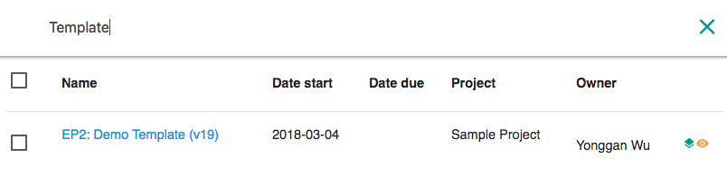
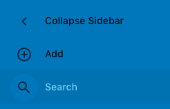
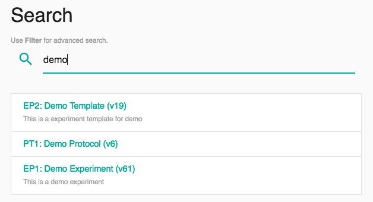
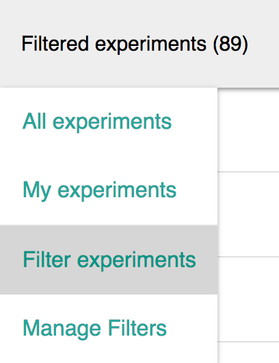

# Search

## In-Page Search

Use this function to narrow down the number of items to display in one page. On the list view of projects, there is a search icon on the top, where you can click and start typing. The results are only from that table category, and will appear as you type. 

## Global Search

If want to search any records match to one or two phases, use global search. 

On the sidebar, click on **Search** to search. 

## Filter

Filter function is table specific. To filter records, first click a table in the side bar, and then choose **Filter xxx** \(the name will update as the table name changes\) from the filter dropdown. 

Once selected, a filter form will be opened. 

**To build a query:**

1. Click **ADD QUERY**
2. Select a Field, Lookup Expression and provide a lookup value.
3. Click **ADD QUERY** again to add more queries.
4. Click **Delete** button to remove the query; Use Up/Down Button to change query order.


The **Name** and **Description** fields are optional. If the **Name** is provided, the filter will be saved and can be accessed from the filter dropdown menu.



When a filter is saved, the **Users** filed can be customized to define who can use the filter. The owner will be added to the users list automatically. 


**Fields:**

Fields are the column title of the table. The list of fields will updated as the table changes. Before using the filter function, you have to have clear idea which field is the data come from. If you are not quite sure, use the [global search](search.md#global-search). 

**Lookup Expression:**

* **Is equal to**, find records that have exactly match to the provided value, case insensitive.
* **Not equal to**, find records that do not match to the provided value.
* **Contains**, find records that contains the provided value, case insensitive.
* **Not contains**, find records that does not contains the string of provided value.
* **Greater than or equal to**, find the records greater than or equal to the provided value, for **Date** and **Number** type of columns only.
* **Less than or equal to**, find the records less than or equal to the provided value, for **Date** and **Number** type of columns only.

**Value:**

The value to lookup.

* Use `true` or `false` for boolean. 
* Use `YYYY-MM-DD` for date.

### Advanced Filter

* Filter by a field: `name__icontains=test`
* Filter by multiple fields: `name__icontains=test&is_archived=false`
* Filter by a filter set: `filter__sid=xxx`, where in a filter set:
  * **AND** relationship shall be expressed in a json object, separate by comma: `{"name__icontains":"test", "is_archived":false}`
  * **OR** relationship shall be expressed in a array: `[{"name__icontains":"test"}, {"is_archived":false}]`
* Filter by multiple filter set: 
  * AND: `filter__sid=xxx,xxx`
  * OR: `filter__sid__in=xxx,xxx`

### Predefined Filters

Building a query is difficult, Labii provides some predefined filters to save your time. Please [contact us](mailto:help@labii.com) if you need help in building custom queries. 

Click **Predefined Filters** in the dropdown to open list of queries ready to use. Click **Use** to try the Filter; click **Save** to save this filter.

Here is a list of predefined queries available to use:

| Name | Description |
| :--- | :--- |
| My Unsigned | The experiments that awaiting for me to sign. |
| My Signed | The experiments that have signed by me. |
| My Co-Authored | The experiments that listed me as Co-Author. |
| My Witnessed | The experiments that listed me as Witness. |
| My Open | The experiments that waiting for me to sign, as Author or Co-Author. |

