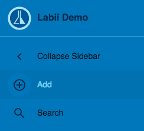
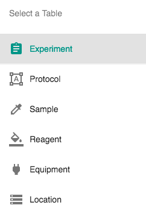
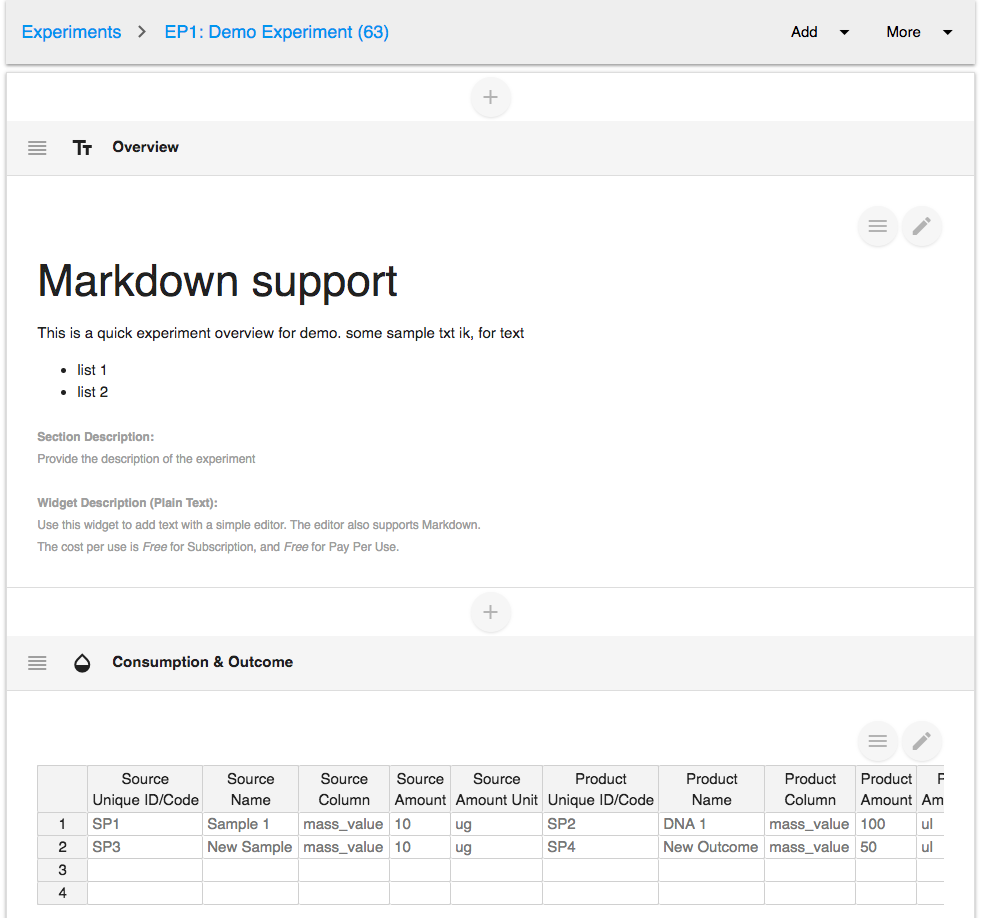
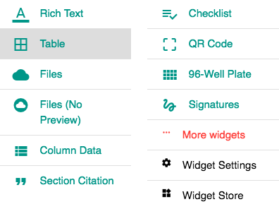
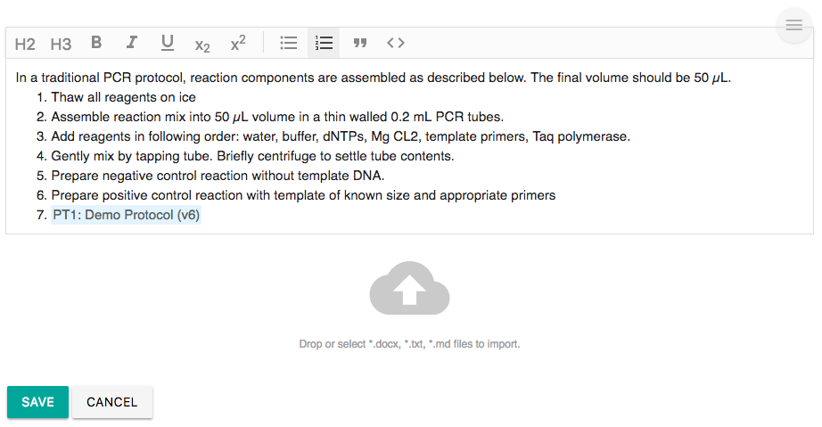

# Quick Start

Welcome to the Quick Start Guide for [Labii ELN & LIMS](https://www.labii.com). Labii helps scientists document, manage, and interpret research data all in one online repository. This guide will walk you through how to create an experiment and add details.



**Create your first experiment in 4 easy steps:**

1. Click the ‘**Add**’ button on the sidebar to open the dropdown menu options. All records including ‘experiment’, ‘protocol’, ‘sample’, and more can be added simply using this menu.

Select ‘**experiment**’ to add a new experiment note in this case. You have the option to change it to other terms that are familiar to you.

2. Fill-in the required and optional information in the fields that appear in the Experiment form window. 


**NOTE**: repetitive experiments can be tagged as ‘templates’ and recalled for later use. Click ‘submit’ to create the new experiment


3. Once submitted, a new experiment record appears with multiple potential sections. The default sections can be configured by your administrators so that they will be added automatically. 

Click the \(+\) signs to insert a new section, or click the **Add** menu on top to add a section at the bottom of the record.

**Labii’s Sections work like the apps in your smartphone, each widget presents one set of functions.**

**For example:** 

Select ‘Rich text’ to edit text just like a word document. Click the edit or pencil icon to modify the data in the section, and click the Submit button to save.

Select ‘Table’ to add a new section similar to a spreadsheet table.

Labii ELN & LIMS is expandable with a list of widgets. More can be found by clicking the ‘More Widgets’ option.


**NOTE**: You do not need to repeat the above steps every time. You can [configure the default sections in the Settings](settings/tables.md#customize-default-sections) and every experiment created will include those sections automatically.


4. Once a new section has been added, you can start entering the content by clicking the Edit icon.

