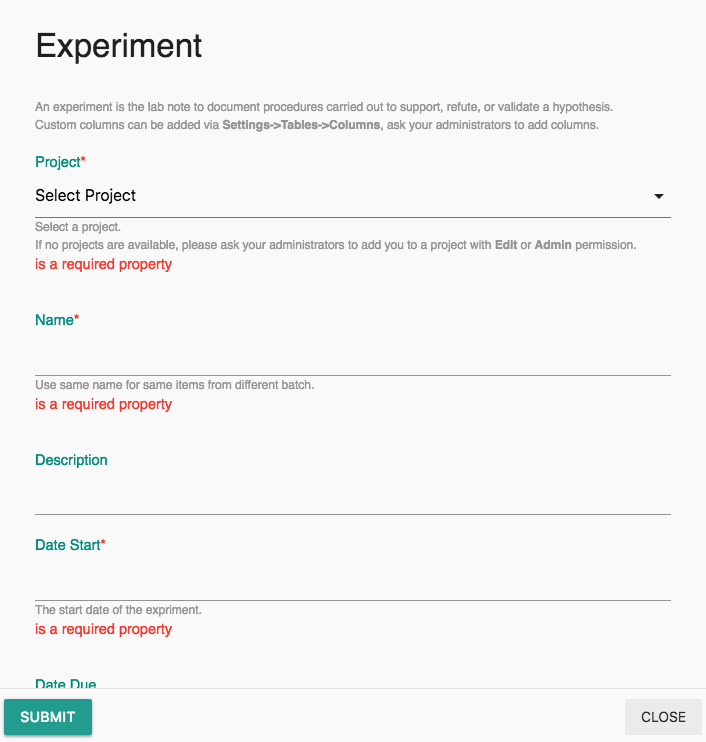

# Quick Start

All records \(experiment, protocol, sample, et.al\) at Labii can be added via clicking the `Add` button on the sidebar. 

1. Click `Add` button at the sidebar. Select an item to add a record. To add an experiment note, choose **Experiment**.


Click the `+` icon to create records from a template.


2. A form will be pop out once clicked. Fill in the form, click `Submit` button to submit. Once submit, a new record will be created and the page will redirect to the detail view of the new record.

3. The new record contains one or more sections. Click section title to expand the section content. Click configure \(gear\) icon to edit the content of the section.


Different sections have different editing interface.


4. To add a new section, click and `Add` button on the top of navigation bar. Choose a widget to add or click **More widgets** to browse more widgets.

That is it. Repeat the above steps to add records for other tables.

