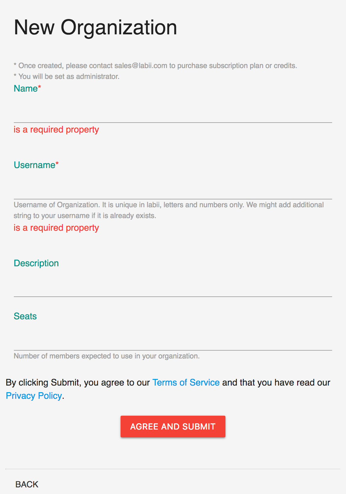

# Add Organization

## Overview

An organization at Labii represents a biotech/pharmaceutical company, an academic lab, department or university. An organization is the customer of Labii and the entirety responsible for the cost that generated in using Labii platform or licensing Labii code or technology.

One company can create one or more Organizations at labii.com. One same email can be added to multiple organizations. Each organization is an individual account and is responsible for the cost of all its users \(In other words, if a email is added to two different organizations, both organizations have to pay for the users subscription fee or pay per use fee\). Please note the data can not be shared between two organizations.

 To add an organization:

1. Settings -&gt; Add Organization
2. Settings -&gt; Switch Organization -&gt; Add Organization

