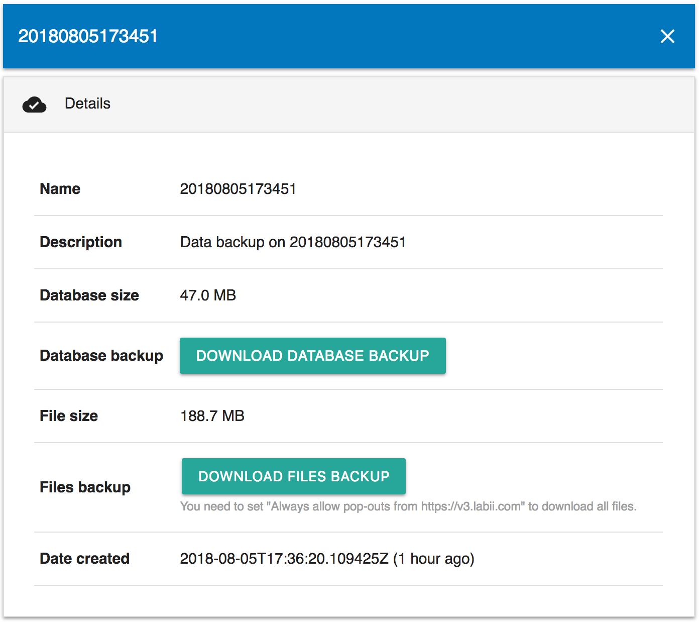
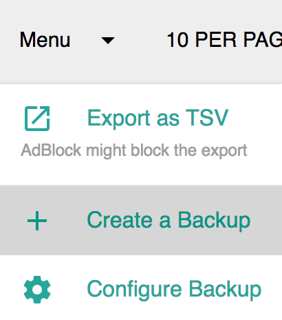
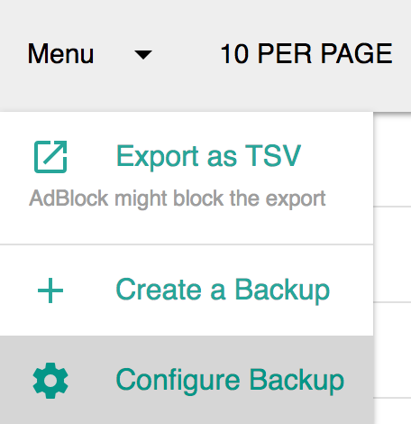
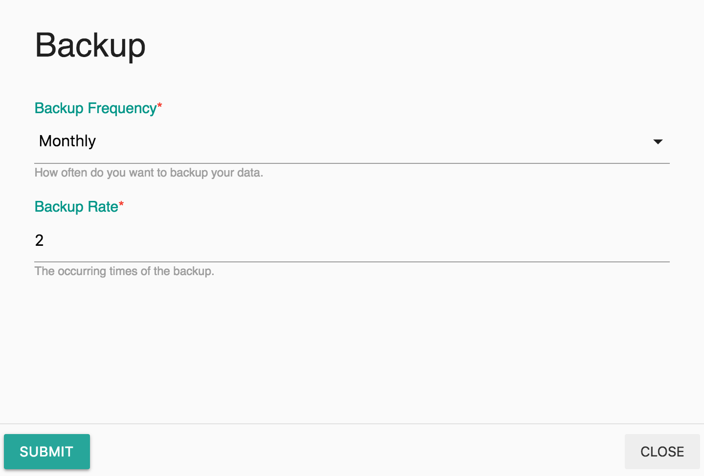

# Backup

## Summary

Backup at Labii is generated automatically. Labii provides two different backups:

* **Database Backup**, all database data of your organization in json format.
* **Files Backup**, all files uploaded.

Both of backups can be downloaded.

## Viewing Backup

Backup is available at **Settings -&gt; Backup**.

A list of backup will be displayed. Click the name of a Backup to view the backup details. Click **Download Database Backup** or **Download Files Backup** to download the backup files.

## Create a Backup

A new backup can be created manually. To do that. Click Menu -&gt; Create a Backup.


This might take a while. It is OK for you to navigate to other pages. The new backup will be available in the list once finished.


## Configure Backup

A backup is created automatic in monthly basis. The backup rate and frequency can be configured as needed.

1. Menu -&gt; Configure Backup  

   

2. In the modal form, update the `backup_frequency` and `backup_rate`. Click the Submit to apply the changes.

