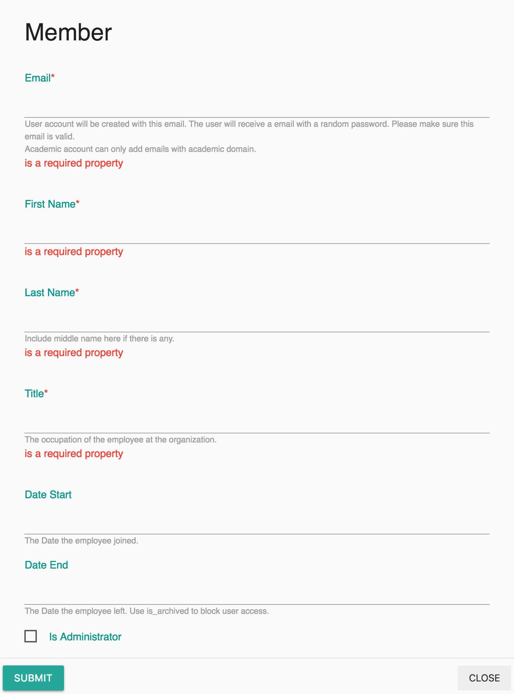
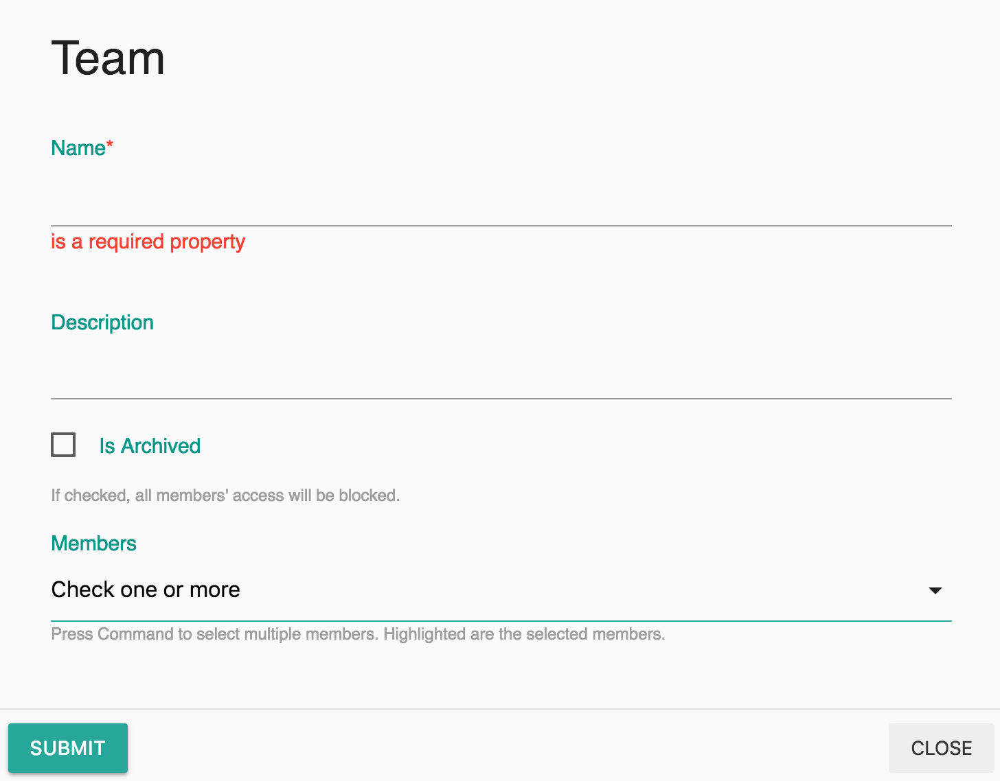

# Members and Teams

## Members

Only members can view or edit the data of the organization. There are 3 different roles for members:

<table>
  <thead>
    <tr>
      <th style="text-align:left">Role</th>
      <th style="text-align:left">Description</th>
      <th style="text-align:left">Positions</th>
    </tr>
  </thead>
  <tbody>
    <tr>
      <td style="text-align:left">Administrators</td>
      <td style="text-align:left">The account administrators, they have full permission to configure the
        account.</td>
      <td style="text-align:left">
        
CEO

        
IT administrators

      </td>
    </tr>
    <tr>
      <td style="text-align:left">Members</td>
      <td style="text-align:left">The active members of the organization. They can view/edit records based
        on project permission settings.</td>
      <td style="text-align:left">
        
Scientists

        
Collaborators

      </td>
    </tr>
    <tr>
      <td style="text-align:left">Alumni</td>
      <td style="text-align:left">The members who have left the organization. Set <code>is_archived=true</code> to
        disable a member's permission. They do not have permission to view/edit
        records.</td>
      <td style="text-align:left"></td>
    </tr>
  </tbody>
</table>**To add a member:** 

Settings -&gt; Member -&gt; Click "+" in the Nav -&gt; Fill in the form and Submit.


Unlimited users can be added for PPU option.

On Subscription option, set `is_archived=true` will free up seat for another user.



**Date End** is used as reference only, it could not a user's permission. Use `is_archived=true` to disable a member's permission. 


## Team

A team is a collection of members. Team can be created to assign same permission to a project. A team is for those members working on the same project. 

**To add a team:** 

Settings -&gt; Team -&gt; Click "+" in the Nav -&gt; Fill in the form and Submit.

