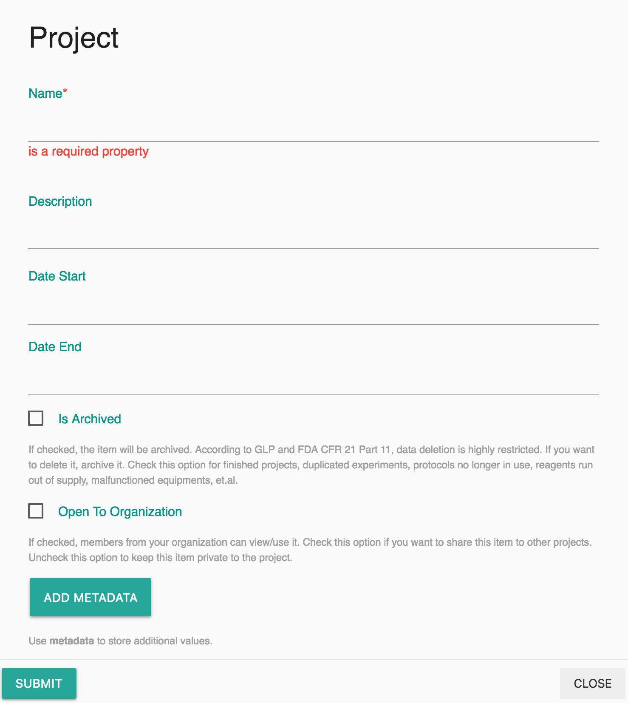
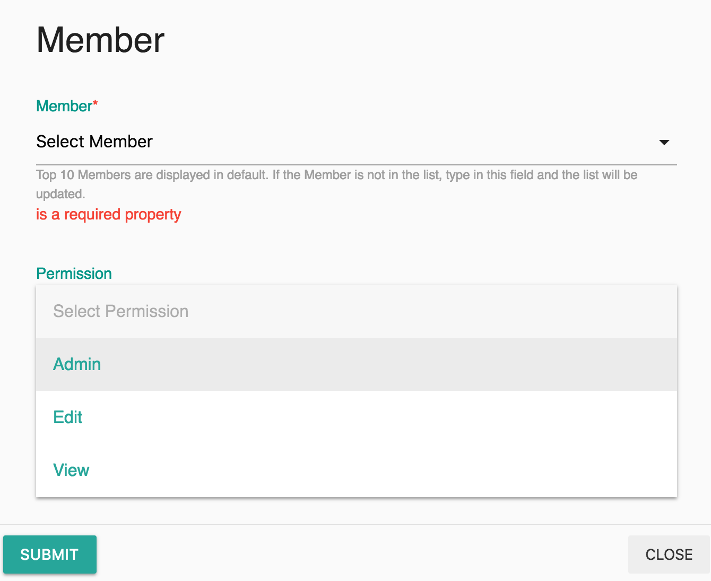

# Projects

## Overview

A project is a particular aim that been carefully planned by an individual or a team. A project at Labii controls the permission of individuals working on the records of different table. 

Organization can create as many projects as possible. Only Administrators can create an project. 

There are 3 different permission levels when joining a project:

| Permission | Description | Positions |
| :--- | :--- | :--- |
| Admin | Can edit project, can view/edit records of the project | Project manager |
| Edit | Can view/edit records of the project | Project member |
| View | Can view records of the project | Members who do not need edit permission |


Administrators do not have permission to add/edit records if they are not added to a project. However, they have view permissions even they are not a member of a project.


## Add Project

To add a project:

Settings -&gt; Member -&gt; Click "+" in the Nav -&gt; Fill in the form and Submit.

## Add Members to a Project

Members can be added at the detail view of the project. To add one or more members:

Settings -&gt; Project -&gt; Click a project name -&gt; Click the "+" of the **Members** section -&gt; Fill in form and Submit

## Add Teams to a Project

Similar to the operation of adding members to a project, a whole team can be added to a project with same permission level. To add teams to a project:

Settings -&gt; Project -&gt; Click a project name -&gt; Click the "+" of the **Teams** section -&gt; Fill in form and Submit


A higher level of permission will be selected if a user have multiple permission of a project. For example, if a user is added to a project with **edit** permission in the member section, and at the same time, the user is added with **view** permission with a team he/she belong to in the team section. This user will have **edit** permission.


