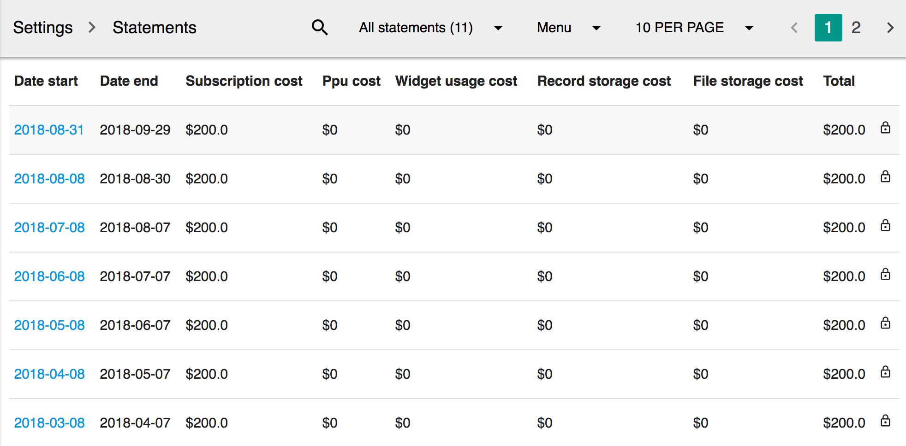

# Statements

## Overview

Statements is generated automatically in monthly basis. Only administrators can view the payment details. Administrators will receive an email notification when each statement is generated.

## Statement List

The following columns are included in statement list display:

* **Date start**, the start date of the statement
* **Date end**, the end date of the statement
* **Subscription cost**, the subscription fee of the statement. If a new user is added during the month, the cost will be reflected in this statement
* **PPU cost**, the cost of creating records. This number will update as more records been created at the statement period. 
* **Widget usage cost**, the cost of using widgets. Some widgets are not free. This fee reflect the cost of using such widgets.
* **Record storage cost**, the database storage fee.
* **File storage cost**, the file storage fee.
* **Total**, total cost.

## Statement Detail

The statement detail contain 3 sections. Overview, Details \(PPU\) and Details \(Widget\).

The **Overview** display the details of each cost, including the count, the price, and the final cost.

**Details \(PPU\)** shows all records created during the statement period.

**Details \(Widget\)** shows all widgets that been charged during the statement period.

