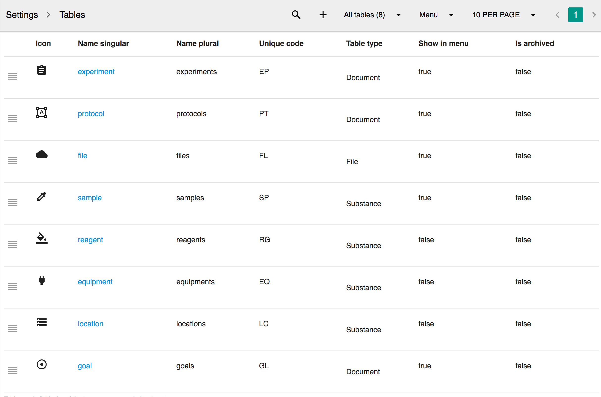
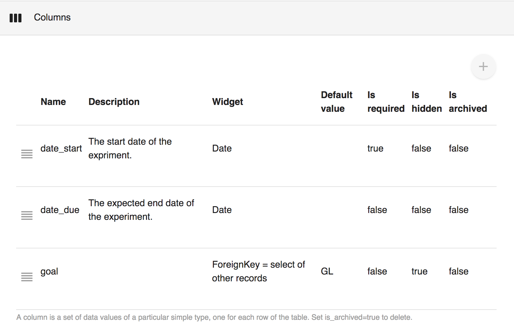

# Tables

## Summary

Use the table settings to customize how do you want to store the data. Please be very careful, each of change will affect your data dramatically. These changes can not be restored. Only Administrators has permission to make changes.

The settings of tables can be reached at **Sidebar -&gt; Settings -&gt; Tables**

## Attributions

All tables is customizable, these attributions can be updated for a table:

| Filed/Attribution | Description |
| :--- | :--- |
| **Icon** | The icon of the table. The icon will be used to display in the sidebar. Use a name from [https://material.io/tools/icons/?style=baseline](https://material.io/tools/icons/?style=baseline) |
| **Name singular** | The name of the table as singular, for example sample |
| **Name plural** | The name of the table as plural, for example samples |
| **Name system** | System reserved table, for example file.  |
| **Unique code** | A few up-case letters that append to id of record |
| **Table type** | Choose of Document or Substance |
| **Show in menu** | Should the table attached in the sidebar |
| **Is archived** | If checked, the table is not available to use. |

## Add a table

Click the "+" icon on the nav bar to add a table, fill in the value as described in the attributions. Only the administrators can do so.

## Customize Column

Columns can be added to meet the specific requirement of the table. 

Click the Column section -&gt; "+" button to add a new column.

## Customize Default Sections

## Customize Filters

