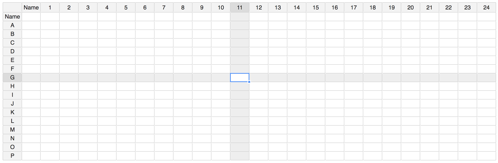

# 384-Well Plate

## About

This Widget is identical to [96-Well Plate](96-well-plate.md) except the layout is designed for 384-well plate. Please refer to [96-well Plate](96-well-plate.md) for details.

## Related To

* [96-Well Plate](96-well-plate.md)

