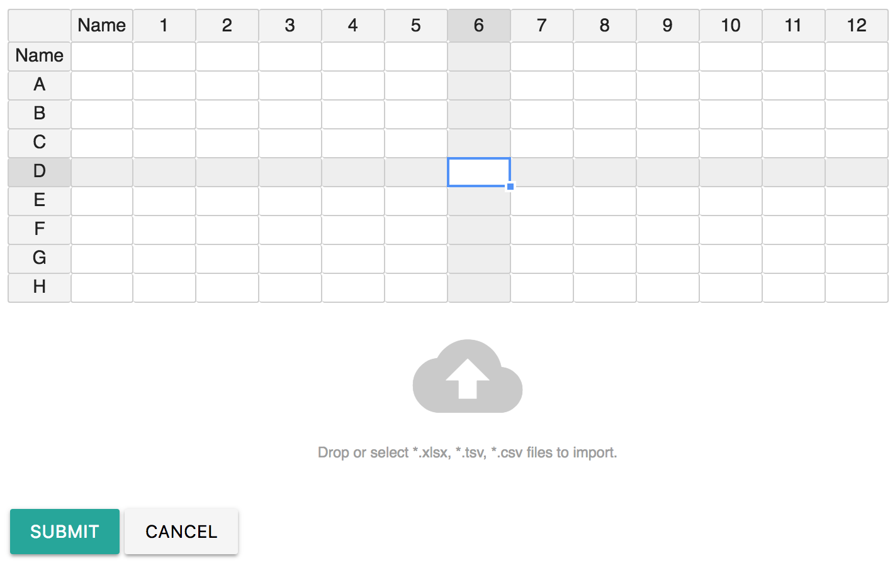

# 96-Well Plate

## Layout

The 96-well plate has 12 columns and 8 rows. The first row and column is reserved for names. The selected row and column will be highlight once selected.

## Edit

Click the [Gear Icon](summary.md#edit-widget) to show edit mode of the widget. 96-Well Plate is based on [Table Widget](table.md) and therefore, the widget inherit all edit methods from the Table widget. That is:

* Click cells to edit
* Support copy and paste from excel sheet
* Support data importing from \*.xlsx, \*.tsv, \*.csv files. 

However, there are some exceptions:

* The number of columns and rows can not been changed, which means no function to insert/delete rows/columns
* When importing data from .xlsx, .tsv, \*.csv files, instead of appending new data, it will replace the existing data. Extra rows and columns will be truncated. 
* Selected row and column will be highlighted.

## Use Case

Use this widget when need to include 96-well plate in experimentation.

## Related To

* [384-Well Plate](384-well-plate.md)

