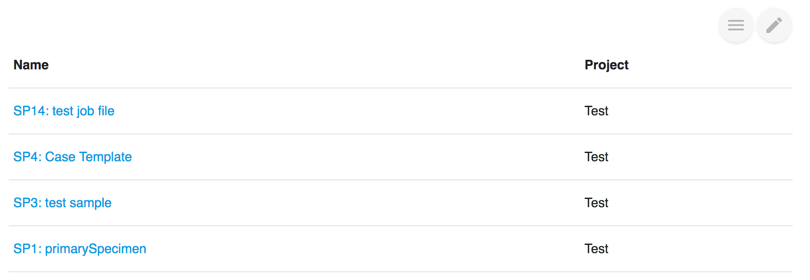

# Backlink

## About

In [Labii ELN & LIMS \(Electronic Lab Notebook and Laboratory Information Management System\)](https://www.labii.com), records can reference each other with the column of ForeignKey and ForeignKeys. When ForeignKey or ForeignKeys column is used in **Record A** to references an **Record B**, how to find out A is referencing B when viewing the details of B? Or, if **Sample A** has a column "location" and refer to **Location B**, how to find out a list of samples sits in **Location B**?

This is exactly what **Backlink** is designed for.

## Edit

3 Fields need to be defined for Backlink. 

* **Table**, the table of the record you want to display.
* **Column**, which ForeignKey or ForeignKeys column referenced to this record. When table changes, the column options changes automatically. 
* **Fields**, other fields to display. On default, the name of the record will be displayed. 

## View

A list of records is displayed, the **name** and the selected **fields** are included. The name is clickable.

