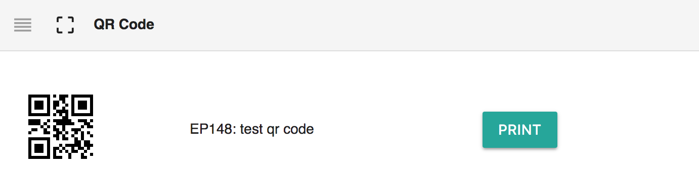
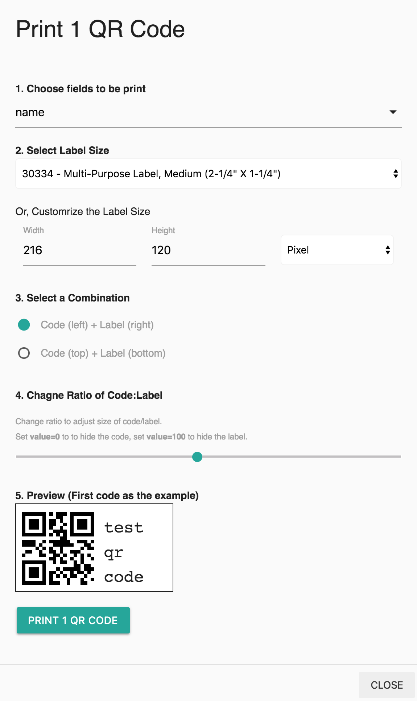
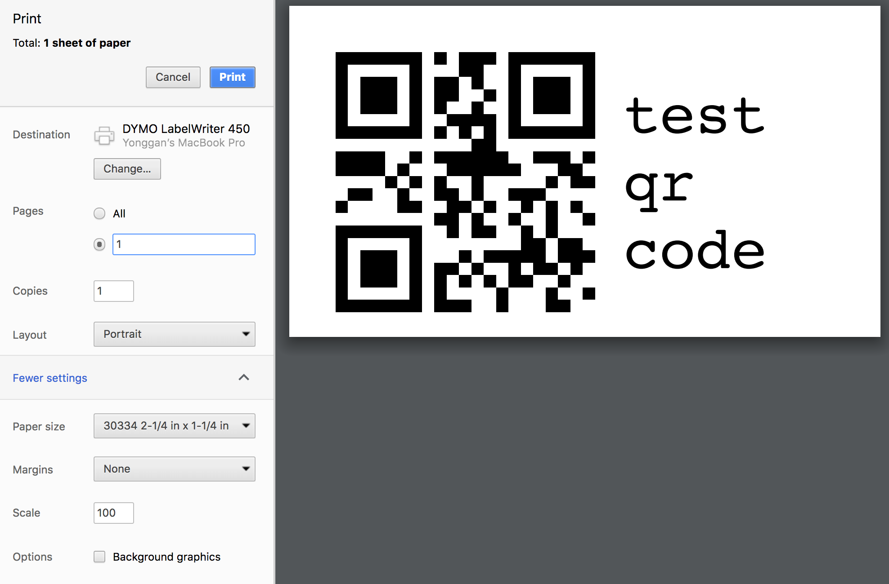

# Barcode

## Summary

[A barcode is an optical, machine-readable, representation of data; the data usually describes something about the object that carries the barcode.](https://en.wikipedia.org/wiki/Barcode) Barcode is widely used in Laboratory Information Management System \(LIMS\) to track the samples and inventories.

The barcode widgets at [Labii ELN & LIMS](https://www.labii.com) is used to show and print the barcode. **Unique ID** is the data encoded into each barcode. Currently, Labii uses QR code, a two dimension barcode, as default barcode.

The QR code can be scanned with any barcode scanner. Smart phone is also supported with proper apps.

| Widget | Type | Description |
| :--- | :--- | :--- |
| QR Code | Section | Display QR Code |
| Barcode | Section | Under development, use QR code instead. |

## Readonly View

Once added, the widget will display the QR code, label. No configuration needed. 

## Print

The QR code can be print out together with labels. To print a  QR code, click the **Print**. 

Labii supports all different kind of label printer, as long as it connects to your computer. Specifically, Labii has been tested with [DYMO](http://www.dymo.com/en-US) printer. 

1. **Choose fields to print.** Use this field to include additional information to print out.
2. **Select Label Size**. Choose a correct label size to print. Labii supports all types of [DYMO label size](https://www.labelvalue.com/dymo-labels.php). If none of listed label match to your size, use the width and height option to customize the label. 
3. **Select a combination**. The position of code and label can be print as left to right, or top to bottom. Click the option to change.
4. **Change ratio of Code:Label**. The size of code and label can be adjusted via changing the range. Set value=0 to hide the code, set value=100 to hide the label.
5. **Preview**. 

Click Print to bring up the printer interface. Make sure to choose

* Correct printer
* Correct paper size
* Set the Margins to None
* Change the Scale if needed.

