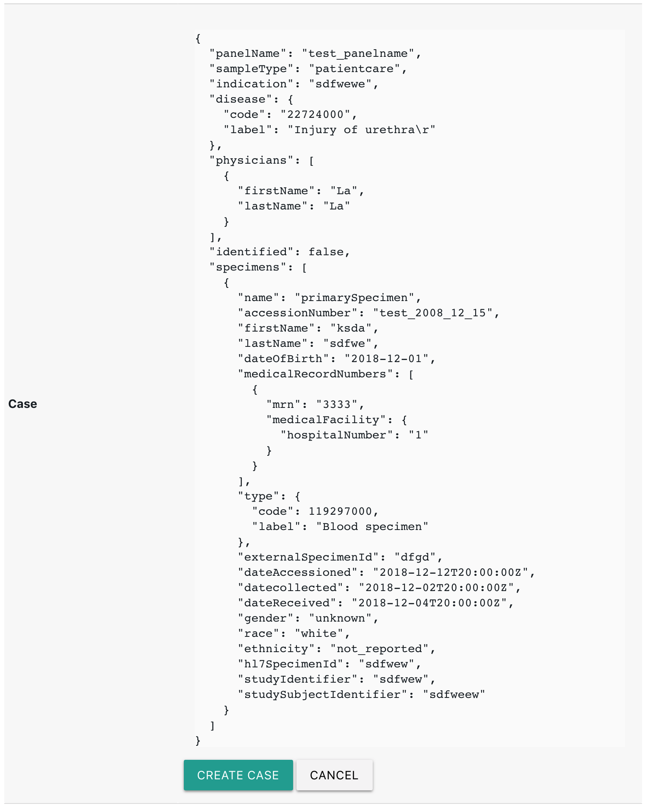
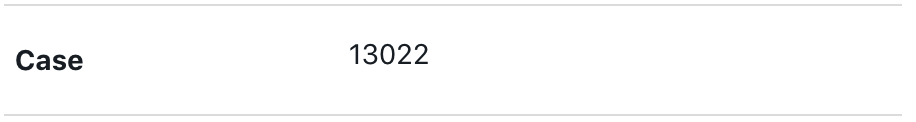
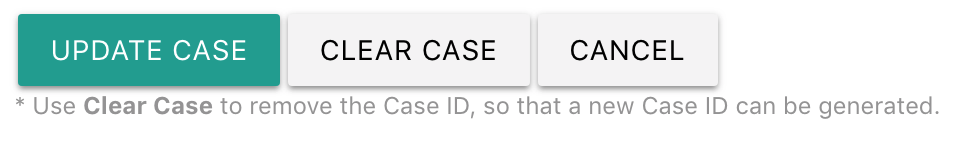
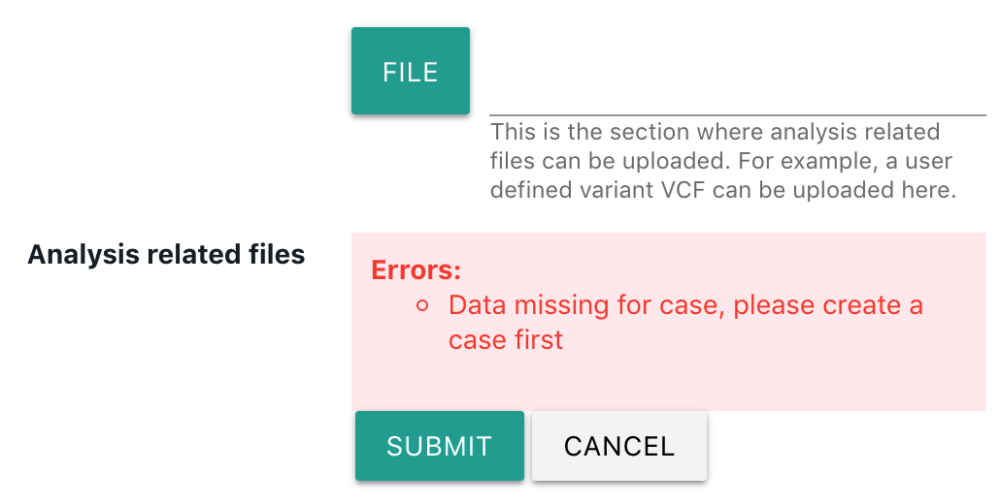
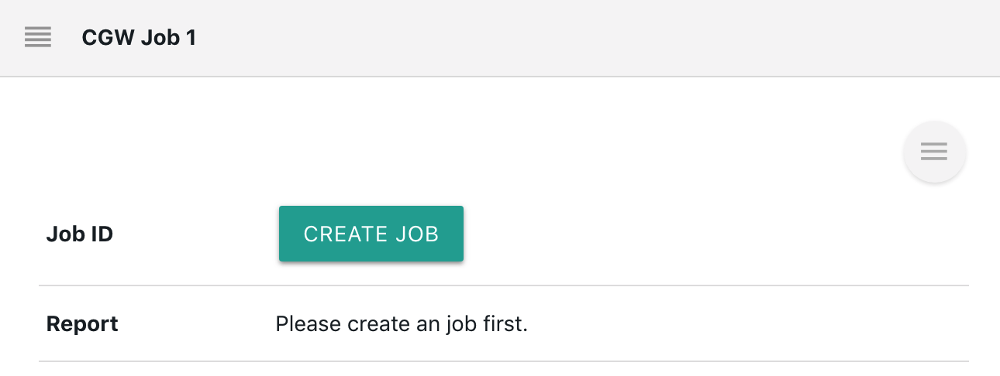
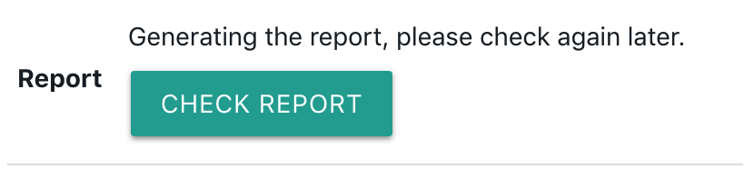
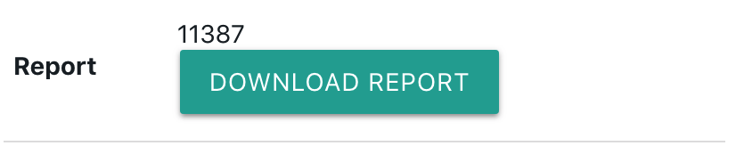

# CGW

## Overview

[Clinical Genomicist Workstation](https://www.pieriandx.com/clinical-genomics-software-for-next-generation-sequencing) \(CGW\) is a secure, n-tiered application where web browser submits requests to application servers that persist the data in a relational database. CGW is used by Washington University Genomic and Pathology Services for clinical genomic testing of many cancers. CGW is a 'soup-to-nuts' solution to track, analyze, interpret, and report clinical genomic diagnostic tests. 


[**Clinical genomicist workstation.**](https://www.ncbi.nlm.nih.gov/pubmed/24303327?report=docsum)\*\*\*\*

Sharma MK, Phillips J, Agarwal S, Wiggins WS, Shrivastava S, Koul SB, Bhattacharjee M, Houchins CD, Kalakota RR, George B, Meyer RR, Spencer DH, Lockwood CM, Nguyen TT, Duncavage EJ, Al-Kateb H, Cottrell CE, Godala S, Lokineni R, Sawant SM, Chatti V, Surampudi S, Sunkishala RR, Darbha R, Macharla S, Milbrandt JD, Virgin HW, Mitra RD, Head RD, Kulkarni S, Bredemeyer A, Pfeifer JD, Seibert K, Nagarajan R.

AMIA Jt Summits Transl Sci Proc. 2013 Mar 18;2013:156-7. eCollection 2013.

PMID: 24303327


Per the request of our customers, [Labii ELN & LIMS](https://www.labii.com) has developed many widgets to perform CGW analysis directly with Labii interface. CGW widgets is developed to create accessions for new cases, create new sequencing runs for cases, upload appropriate data files \(VCF/BAM files\) for a given sequencing run, begin bioinformatics jobs for generating a pharmacogenomic report, and retrieve reports in pdf format after they have been signed off on by an accredited individual.

Besides, the widgets can use full advantages of Labii LIMS \([Laboratory Information Management System](https://www.labii.com)\) to provide sample specific metadata. Labii widgets simplified the usage of CGW with just a few clicks and enabled the documentation of all analysis process.


Notes: These widgets are private to a certain customer\(s\) only. 


Labii ELN & LIMS currently provides these widgets:

| Widget | Type | Description |
| :--- | :--- | :--- |
| [CGWCase](cgw.md#cgwcase) | Column | Create a CGW case |
| [CGWUploadFile](cgw.md#cgwuploadfile) | Column | Upload analysis-related files |
| [CGWJob](cgw.md#cgwjob) | Section | Generate a job and report |

## Before started

Here are some settings needed to be configured before starting using the widgets.

### Metadata

CGW is account specific, your CGW authentication information needs to be provided and configured in the [organization metadata](../settings/organization-detail.md#metadata) \(Settings -&gt; Organization Detail -&gt; Metadata\).

These metadata is required:

* **CGW\_INSTITUTION**: your account username
* **CGW\_EMAIL**: your email address to login
* **CGW\_PASSWORD**: your password
* **CGW\_VERSION**: v2.0.0

### Tables

The samples and patients are stored in the tables. These tables are required:

* **samples**, to store specimen information
* **patients**, to store the patient information 
* **disease**, to store disease code
* **mass**, to store the sample type code

Please create the tables with these settings:

| Name singular | Name plural | Description | Unique code |
| :--- | :--- | :--- | :--- |
| sample | samples | Specimen information | SP |
| patient | patients | Patient information | PA |
| disease | diseases | Disease code | DS |
| mass | masses | Sampel type code | MS |

### Columns

The columns are used to store the attributions of a table. 

**Samples:**

<table>
  <thead>
    <tr>
      <th style="text-align:left">Name</th>
      <th style="text-align:left">Description</th>
      <th style="text-align:left">Widget</th>
      <th style="text-align:left">Default Value</th>
      <th style="text-align:left">Is Required</th>
    </tr>
  </thead>
  <tbody>
    <tr>
      <td style="text-align:left">dateAccessioned</td>
      <td style="text-align:left"></td>
      <td style="text-align:left">Date</td>
      <td style="text-align:left"></td>
      <td style="text-align:left">false</td>
    </tr>
    <tr>
      <td style="text-align:left">firstName</td>
      <td style="text-align:left"></td>
      <td style="text-align:left">Text</td>
      <td style="text-align:left"></td>
      <td style="text-align:left">false</td>
    </tr>
    <tr>
      <td style="text-align:left">lastName</td>
      <td style="text-align:left"></td>
      <td style="text-align:left">Text</td>
      <td style="text-align:left"></td>
      <td style="text-align:left">false</td>
    </tr>
    <tr>
      <td style="text-align:left">dateOfBirth</td>
      <td style="text-align:left"></td>
      <td style="text-align:left">Date</td>
      <td style="text-align:left"></td>
      <td style="text-align:left">false</td>
    </tr>
    <tr>
      <td style="text-align:left">datecollected</td>
      <td style="text-align:left"></td>
      <td style="text-align:left">Date</td>
      <td style="text-align:left"></td>
      <td style="text-align:left">false</td>
    </tr>
    <tr>
      <td style="text-align:left">dateReceived</td>
      <td style="text-align:left"></td>
      <td style="text-align:left">Date</td>
      <td style="text-align:left"></td>
      <td style="text-align:left">false</td>
    </tr>
    <tr>
      <td style="text-align:left">gender</td>
      <td style="text-align:left"></td>
      <td style="text-align:left">Select</td>
      <td style="text-align:left">
        
unknown

        
male

        
female

        
unspecified

        
other

        
ambiguous

        
not_applicable

      </td>
      <td style="text-align:left">false</td>
    </tr>
    <tr>
      <td style="text-align:left">race</td>
      <td style="text-align:left"></td>
      <td style="text-align:left">Select</td>
      <td style="text-align:left">
        
american_indian_or_alaska_native

        
asian

        
black_or_african_american

        
native_hawaiian_or_other_pacific_islander

        
not_reported

        
unknown

        
white

      </td>
      <td style="text-align:left">false</td>
    </tr>
    <tr>
      <td style="text-align:left">ethnicity</td>
      <td style="text-align:left"></td>
      <td style="text-align:left">Select</td>
      <td style="text-align:left">
        
hispanic_or_latino

        
not_hispanic_or_latino

        
not_reported

        
unknown

      </td>
      <td style="text-align:left">false</td>
    </tr>
    <tr>
      <td style="text-align:left">externalSpecimenId</td>
      <td style="text-align:left"></td>
      <td style="text-align:left">Text</td>
      <td style="text-align:left"></td>
      <td style="text-align:left">false</td>
    </tr>
    <tr>
      <td style="text-align:left">hl7SpecimenId</td>
      <td style="text-align:left"></td>
      <td style="text-align:left">Text</td>
      <td style="text-align:left"></td>
      <td style="text-align:left">false</td>
    </tr>
    <tr>
      <td style="text-align:left">studyIdentifier</td>
      <td style="text-align:left"></td>
      <td style="text-align:left">Text</td>
      <td style="text-align:left"></td>
      <td style="text-align:left">false</td>
    </tr>
    <tr>
      <td style="text-align:left">studySubjectIdentifier</td>
      <td style="text-align:left"></td>
      <td style="text-align:left">Text</td>
      <td style="text-align:left"></td>
      <td style="text-align:left">false</td>
    </tr>
    <tr>
      <td style="text-align:left">type</td>
      <td style="text-align:left">Sample Type</td>
      <td style="text-align:left">ForeignKey</td>
      <td style="text-align:left">MS</td>
      <td style="text-align:left">true</td>
    </tr>
    <tr>
      <td style="text-align:left">panelName</td>
      <td style="text-align:left"></td>
      <td style="text-align:left">Text</td>
      <td style="text-align:left"></td>
      <td style="text-align:left">false</td>
    </tr>
    <tr>
      <td style="text-align:left">sampleType</td>
      <td style="text-align:left"></td>
      <td style="text-align:left">Select</td>
      <td style="text-align:left">patientcare</td>
      <td style="text-align:left">true</td>
    </tr>
    <tr>
      <td style="text-align:left">indication</td>
      <td style="text-align:left"></td>
      <td style="text-align:left">Text</td>
      <td style="text-align:left"></td>
      <td style="text-align:left">false</td>
    </tr>
    <tr>
      <td style="text-align:left">identified</td>
      <td style="text-align:left"></td>
      <td style="text-align:left">Boolean</td>
      <td style="text-align:left">1</td>
      <td style="text-align:left">false</td>
    </tr>
    <tr>
      <td style="text-align:left">disease</td>
      <td style="text-align:left"></td>
      <td style="text-align:left">ForeignKey</td>
      <td style="text-align:left">DS</td>
      <td style="text-align:left">false</td>
    </tr>
    <tr>
      <td style="text-align:left">physicians</td>
      <td style="text-align:left"></td>
      <td style="text-align:left">ForeignKeys</td>
      <td style="text-align:left">PA</td>
      <td style="text-align:left">false</td>
    </tr>
    <tr>
      <td style="text-align:left">accessionNumber</td>
      <td style="text-align:left"></td>
      <td style="text-align:left">Text</td>
      <td style="text-align:left"></td>
      <td style="text-align:left">false</td>
    </tr>
    <tr>
      <td style="text-align:left">case</td>
      <td style="text-align:left"></td>
      <td style="text-align:left">CGWCase</td>
      <td style="text-align:left"></td>
      <td style="text-align:left">false</td>
    </tr>
    <tr>
      <td style="text-align:left">lane</td>
      <td style="text-align:left"></td>
      <td style="text-align:left">Number</td>
      <td style="text-align:left">1</td>
      <td style="text-align:left">false</td>
    </tr>
    <tr>
      <td style="text-align:left">barcode</td>
      <td style="text-align:left"></td>
      <td style="text-align:left">Text</td>
      <td style="text-align:left"></td>
      <td style="text-align:left">false</td>
    </tr>
    <tr>
      <td style="text-align:left">runType</td>
      <td style="text-align:left">This identifies whether the sequencing was done using paired end or single
        end.</td>
      <td style="text-align:left">Select</td>
      <td style="text-align:left">pairedEnd</td>
      <td style="text-align:left">false</td>
    </tr>
    <tr>
      <td style="text-align:left">analysis_related_files</td>
      <td style="text-align:left"></td>
      <td style="text-align:left">CGWUploadFile</td>
      <td style="text-align:left"></td>
      <td style="text-align:left">false</td>
    </tr>
  </tbody>
</table>**Patients:**

No specific columns are required. However, the name field have to be:

`[First Name] [Last Name]`

**Disease:**

| Name | Widget | Default value | Is required |
| :--- | :--- | :--- | :--- |
| code | Number |  | TRUE |
| code\_system | Text | SNOMED-CT | TRUE |

**Mass:**

| Name | Widget | Default value | Is required |
| :--- | :--- | :--- | :--- |
| code | Number |  | TRUE |
| code\_system | Text | SNOMED-CT | TRUE |

### Default Sections

Add a default section so that all new records will have the same section. The default section is only needed for samples:

* **Job**, use the widget of **CGWJob**

### Import data

If you already have some data for samples, patients, disease, and/or mass, use [Import](../eln-and-lims/list-view.md#import) function to import them first.

## CGWCase

CGWCase is a widget to create or update a Case. 

### Create a case

Click the _edit_ icon and the widget shall collect all necessary information to create a case. Error message will be provided if certain data is missing.

Click **Create Case** button to create a case. If successful, a case id will be stored for the column.

### Update a case

The detail of a case can be updated via update a case. To do that, click the _edit_ icon, and then click the **Update Case** button.

### Clear case data

If for some reason, you want to discard the case and redo the analysis. You can click **Clear Case** button and then create a new case.

## CGWUploadFile

A \*.vcf file needs to be uploaded to initial the jobs. Use this widget to upload a \*.vcf file. A case needs to be created first for this widget to work.

## CGWJob

One or more CGW jobs can be created for one sample. Each section of CGWJob can create one job.

Before creating a CGW job, a CGW case need to be created and a \*.vcf file need to be uploaded first.

### Create a job

Click **Create a job** button to create a job. 

Once a job is created, the job id will be assigned to the job id.

### Cancel a job

Once a job is created, it can be canceled via clicking **Cancel Job** button. 


Note: Currently, the CGW API to cancel job is not working.


### Check report

Once a job is generated, the job will start running immediately. It will take around two hours to finish the CGW scripts.

You can use the button **Check report** to check if the report is completed. If it is completed, a report id will be assigned and you will have the option to download the report.

### Download report

Once a reported is completed, the report can be downloaded via clicking Download report button.

The report is generated in PDF format, and zipped in a package **\[Report Id\].pdf.gz**.

## CGW Workflow

To start a CGW analysis, please follow these steps. This workflow assuming you have configured everything in [Before started](cgw.md#before-started).

1. Add a new sample, fill in all necessary information.
2. [Create a new case](cgw.md#create-a-case) from **Case** column.
3. [Upload a \*.vcf file](cgw.md#cgwuploadfile) from **Analysis related files** column.
4. Add a new section with widget CGWJob \(optional, such section will be created automatically if correctly configured in the [default sections](cgw.md#default-sections)\). 
5. [Create a new job](cgw.md#create-a-job).
6. [Check the report](cgw.md#check-report).
7. [Download the report](cgw.md#download-report).

