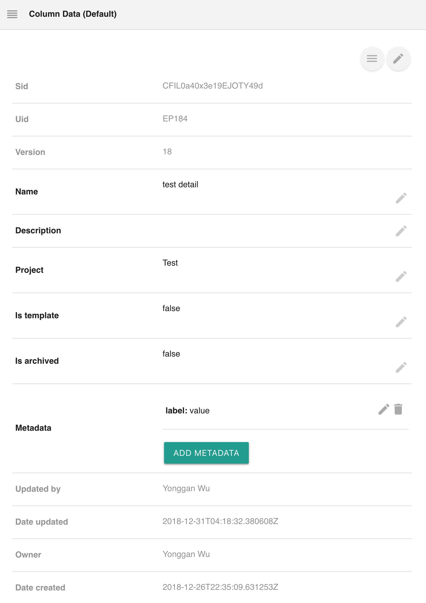
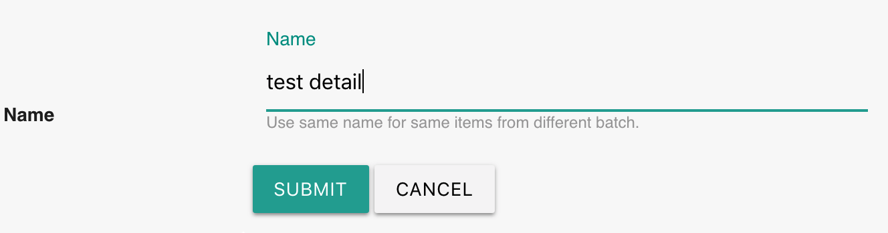
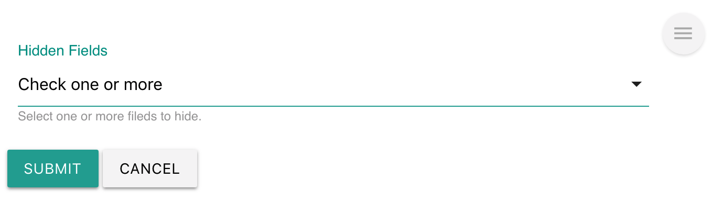

# Columns

## Overview

[Labii ELN & LIMS \(Electronic Lab Notebook and Laboratory Information Management System\) ](https://www.labii.com)allows custom columns for each table. In the [List View](../eln-and-lims/list-view.md), not all columns are visible. The details of all other columns can be displayed and edited with Column widget.

Labii ELN & LIMS currently provides these widgets:

| Widget | Type | Description |
| :--- | :--- | :--- |
| Columns | Section | Display the detail of columns |

## Columns

The interface of the Column displays the value of each attribution/column in rows. Gray text indicates read-only values.

### Edit value

Click the edit icon next to each row to edit a value.

The edit icon will be disappeared on the records that locked from editing.

### Hide value

Some fields can be hide if you do not want to display them. Click the edit icon on the top right to configure the hidden fields.

