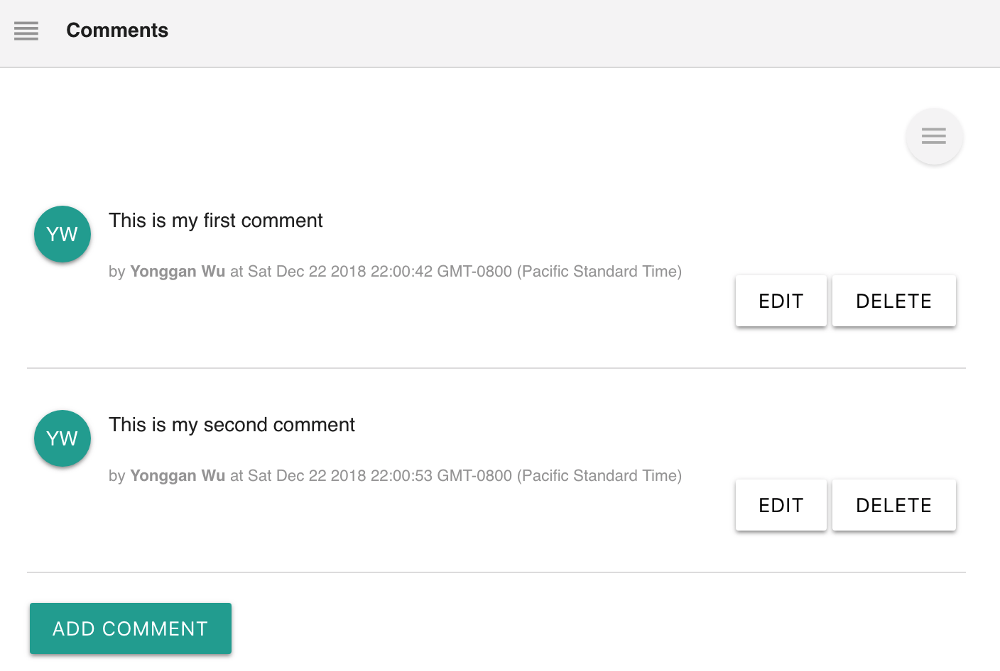
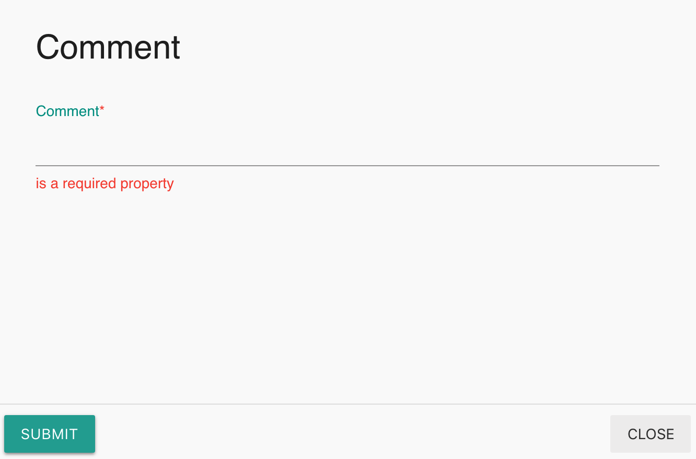

# Comments

## Overview

Additional text messages can be added to [Labii Electronic Lab Notebook and Laboratory Information Management System](https://www.labii.com). 

Labii ELN & LIMS currently provides these widgets:

| Widget | Type | Description |
| :--- | :--- | :--- |
| Comments | Section | Add comments to a record |
| GLP Comments | Section | Comments could not be changed once signed |

**Difference between Comments and GLP Comments**

The functionalities of **Comments** and **GLP Comments** are exactly the same. **GLP Comments** is different to **Comments** in that the widget meets GLP regulation. Specifically:

* Comments can be added, modified, and deleted regardless whether a record is locked or not with **Comments** widget.
* Comments will be locked from editing once a record is signed with **GLP Comments**.


Be caution when using Comments widget because it is not GLP complainant. Data entered could not be used for patient application or FDA regulation. 


## Comments

List of comments will be displayed in the widget.

### Add a comment

Click "**Add Comment**" to add a comment. 

### Edit a comment

Click the "**Edit**" button next to a comment to edit a comment.

### Delete a comment

Click the "**Delete**" button next to a comment to delete a comment.

