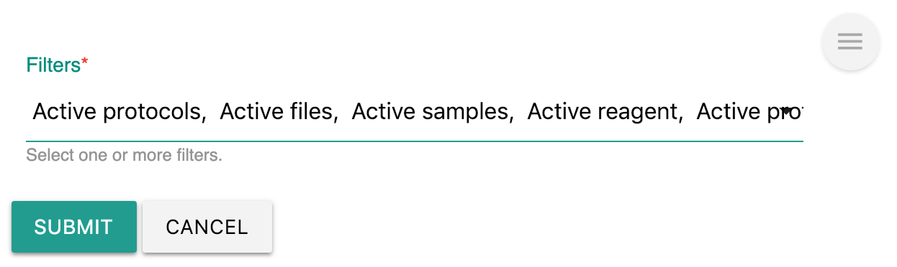

# Count

## Summary

[Labii ELN & LIMS \(Electronic Lab Notebook and Laboratory Information Management System\)](https://www.labii.com/) is also helping scientist to interpret their research data. A group of widgets will be developed to provide count summary.

Labii ELN & LIMS currently provides these widgets:

| Widget | Type | Description |
| :--- | :--- | :--- |
| Filter Summary | Section | Provide count summary to filters |

## Filter Summary

**Filter Summary** is a widget that provides the count summary of each filter. It provides the views of a table and a bar chart. The count number is generated at real time and the count will be updated.

The filters can be configured via clicking the **edit** icon. 


You can compare the filter from different tables.



Note: Different user might see different number because of their permission settings.


