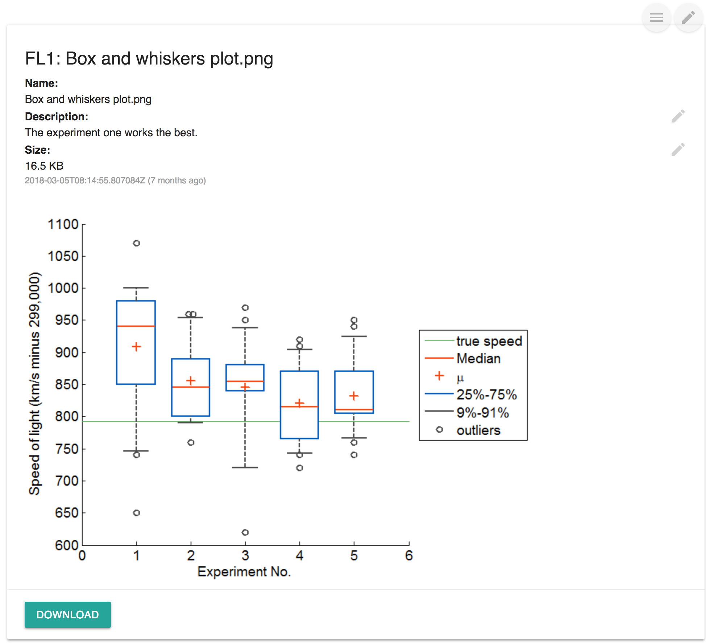
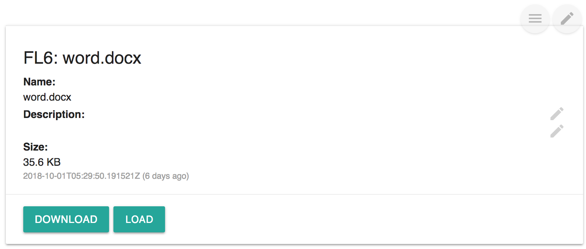
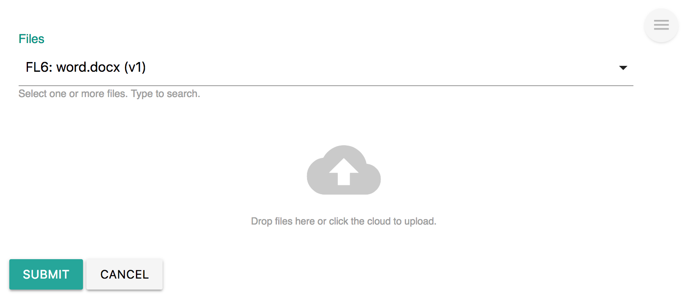
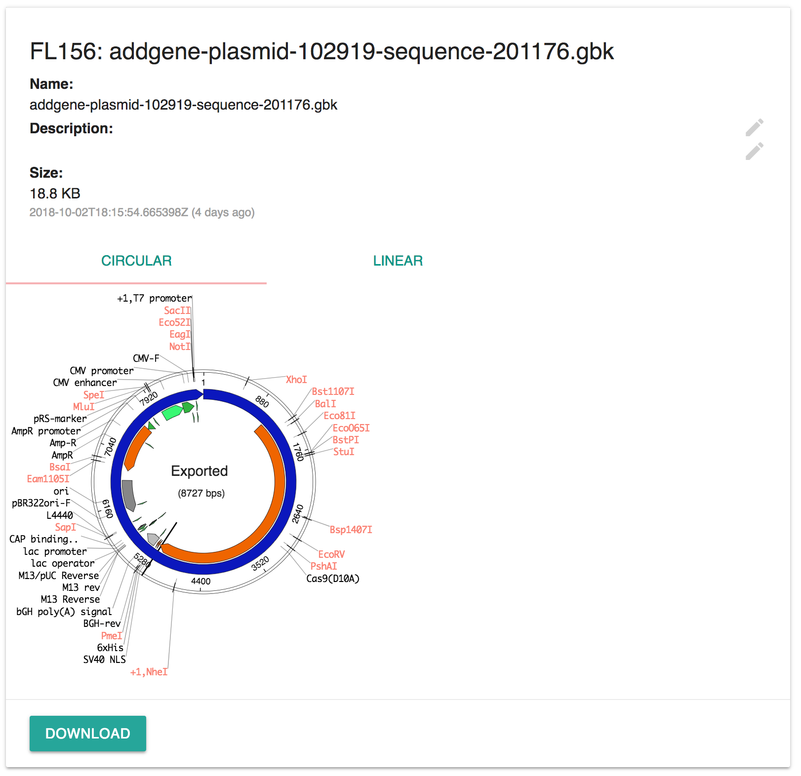

# File

## Overview

File widgets is used to insert file\(s\) into the detail of a record. The files can be those files already uploaded to [Labii ELN & LIMS](https://www.labii.com) or the files in the local computer and upload directly in the widget.

Labii ELN & LIMS currently provides these widgets:

| Widget | Type | Description |
| :--- | :--- | :--- |
| File | Section | Display one file |
| Files | Section | Display one or more files |
| Files \(No Preview\) | Section | Display one or more files without preview |

## File Types

Labii supports all files in uploading and support bellow files in previewing. 

Supported files in preview:

| Files | Suffix | Notes |
| :--- | :--- | :--- |
| Pictures | \*.jpg, \*.jpeg, \*.png, \*.gif, \*.bmp, \*.tiff | \*.tiff only supports in Safari browser |
| Text | \*.txt |  |
| Tabular Data | \*.tsv, \*.csv |  |
| PDF | \*.pdf |  |
| Word | \*.doc, \*.docx |  |
| Excel | \*.xls, \*.xlsx |  |
| PowerPoint | \*.ppt, \*.pptx |  |
| GenBank | \*.gb, \*.gbk | Display circular and linear map |

## Readonly View

File information is display on the readonly view. The readonly view for each file contains these information:

* File name
* File description
* File size
* Date time
* File preview. File preview is hidden in **Files \(No Preview\)** widget or for any files that is bigger than 500KB.
* Download

### Update File Name and Description

The file name and description can be updated via clicking "Edit" icon.

## Edit View

Click 'edit' icon to show the edit view. One \(File widget\) or more files \(Files and Files \(No Preview\)\) can be selected, or one or more files can be uploaded at the same time.

**To select file\(s\)**: click the dropdown to select the files.

**To upload files\(s\):** drag and drop files to the "cloud" icon or click the "cloud" icon to choose files in your local computer. 


When selecting files, you can type file name to search a file.


## Examples

This section show off many cool function of File widget.

### Plasmid Map

The plasmid map of a Genbank file can be displayed in a circular or linear map.

