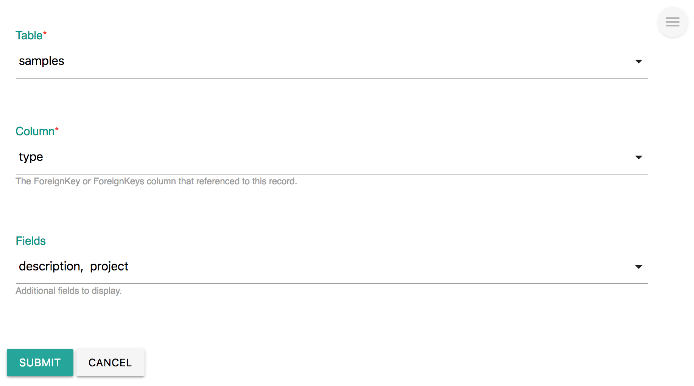
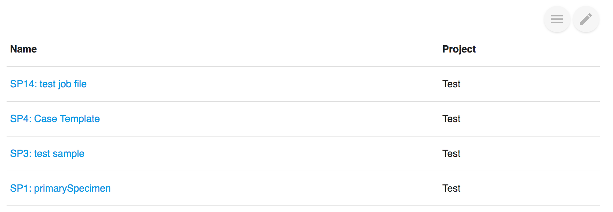

# Foreign Key Relationships

## Overview

In [Labii ELN & LIMS \(Electronic Lab Notebook and Laboratory Information Management System\)](https://www.labii.com), records can reference each other with the column of ForeignKey and ForeignKeys. Labii has developed and is developing a serious widgets to utilize the foreign key relationship.

[Labii ELN and LIMS](https://www.labii.com/) currently provides these widgets:

| Widget | Type | Description |
| :--- | :--- | :--- |
| ForeignKey | Column | Link to one other record |
| ForeignKeys | Column | Link to one or more records |
| Backlink | Section | Show the records that linked |
| Section Citation | Section | Show section content of other record |

## Backlink

When ForeignKey or ForeignKeys column is used in **Record A** to references an **Record B**, how to find out A is referencing B when viewing the details of B? Or, if **Sample A** has a column "location" and refer to **Location B**, how to find out a list of samples sits in **Location B**?

This is exactly what **Backlink** is designed for.

### Edit

3 Fields need to be defined for Backlink. 

* **Table**, the table of the record you want to display.
* **Column**, which ForeignKey or ForeignKeys column referenced to this record. When table changes, the column options changes automatically. 
* **Fields**, other fields to display. On default, the name of the record will be displayed. 

### View

A list of records is displayed, the **name** and the selected **fields** are included. The name is clickable.

### Create new linked record

To display a new record under **Backlink**, a new record need to be created first and use ForeignKey\(s\) to link back. This is not user-friendly, and the user have to navigate away from the current record. 

We just added this new function that enable user to create a new record directly inside the **Backlink** widget. Besides, it linked with the current record directly based on your Backlink settings. 

Simple click the "New XXX" button, and the pop put window is exactly identical to [Add Record](../eln-and-lims/add-record.md).

