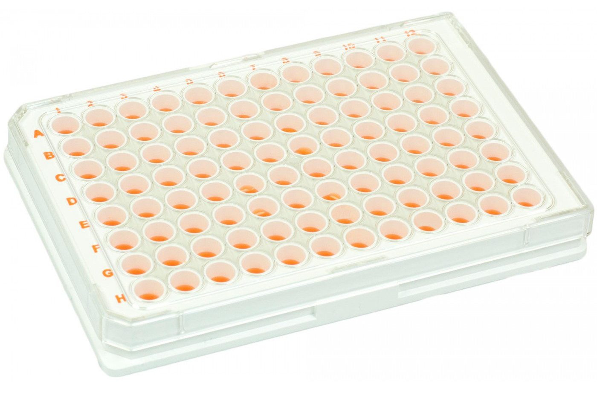
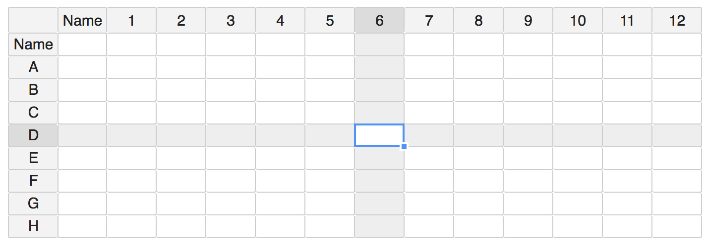
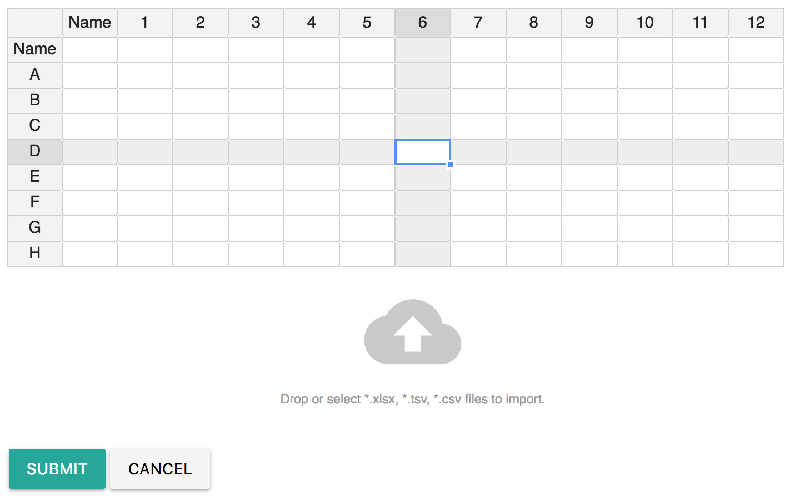

# Microplate

## Overview

A microplate or microtiter plate, microwell plate, multiwell is a flat plate with multiple "wells" used as small test tubes. The microplate has become a standard tool in analytical research and clinical diagnostic testing laboratories. A very common usage is in the enzyme-linked immunosorbent assay \(ELISA\), the basis of most modern medical diagnostic testing in humans and animals.

A microplate typically has 6, 12, 24, 48, 96, 384 or 1536 sample wells arranged in a 2:3 rectangular matrix. Some microplates have been manufactured with 3456 or 9600 wells, and an "array tape" product has been developed that provides a continuous strip of microplates embossed on a flexible plastic tape. Read more at [https://en.wikipedia.org/wiki/Microplate](https://en.wikipedia.org/wiki/Microplate)

Microplate are commonly used is labs and should be documented in Electronic Lab Notebook \(ELN\). 

[Labii ELN and LIMS](https://www.labii.com) currently provides these widgets:

| Widget | Type | Description |
| :--- | :--- | :--- |
| 6-Well Plate | Section | Under developing |
| 12-Well Plate | Section | Under developing |
| 24-Well Plate | Section | Under developing |
| 48-Well Plate | Section | Under developing |
| 96-Well Plate | Section | Layout of 96-well plate |
| 384-Well Plate | Section | 24 columns and 16 rows |

## Layout

All the plate widgets share similar layout, except they have different dimensions. The first row and column is reserved for names. The selected row and column will be highlight once selected.

| Widget | No. Columns | No. of Rows |
| :--- | :--- | :--- |
| 6-Well Plate | 3 | 2 |
| 12-Well Plate | 4 | 3 |
| 24-Well Plate | 6 | 4 |
| 48-Well Plate | 8 | 6 |
| 96-Well Plate | 12 | 8 |
| 384-Well Plate | 24 | 16 |

## Edit

Click the [Gear Icon](summary.md#edit-widget) to show edit mode of the widget. The Well Plate Widgets are based on [Table Widget](table.md) and therefore, the widget inherit all edit methods from the Table widget. That is:

* Click cells to edit
* Support copy and paste from excel sheet
* Support data importing from \*.xlsx, \*.tsv, \*.csv files. 

However, there are some exceptions:

* The number of columns and rows can not been changed, which means no function to insert/delete rows/columns
* When importing data from \*.xlsx, .tsv, \*.csv files, instead of appending new data, it will replace the existing data. Extra rows and columns will be truncated. Also, only the first sheet of \*.xlsx will be imported.
* Selected row and column will be highlighted.

## Use Case

Use these widget when need to include a well plate in experimentation.

