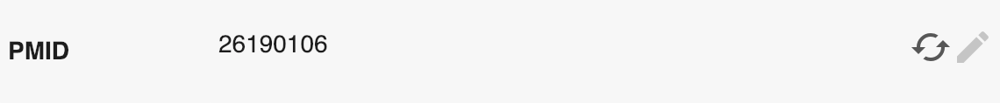
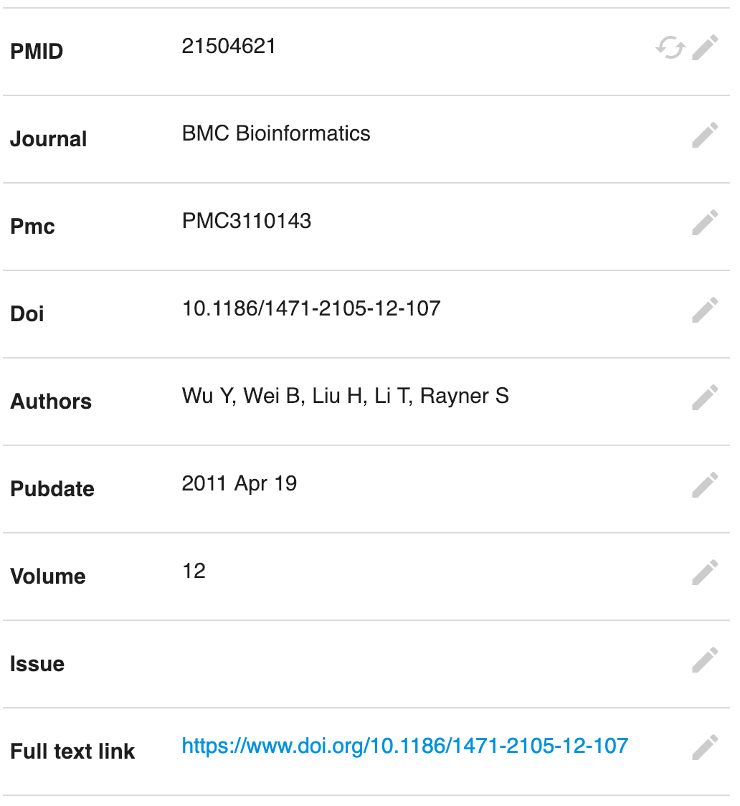
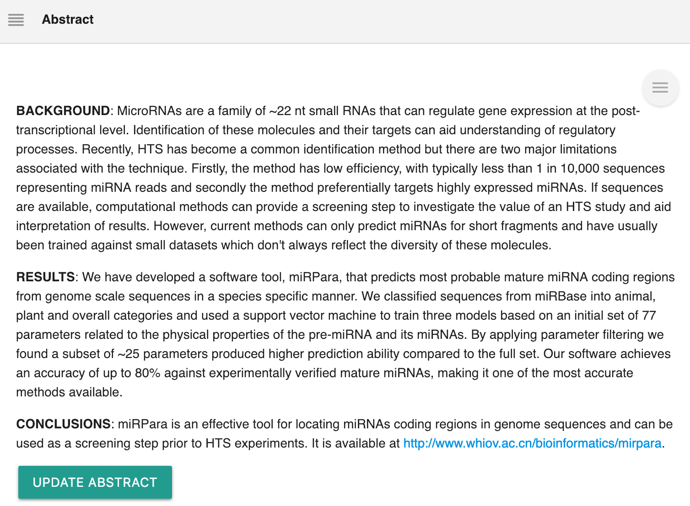
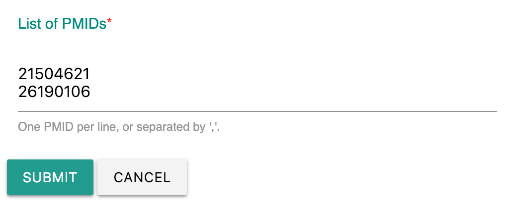
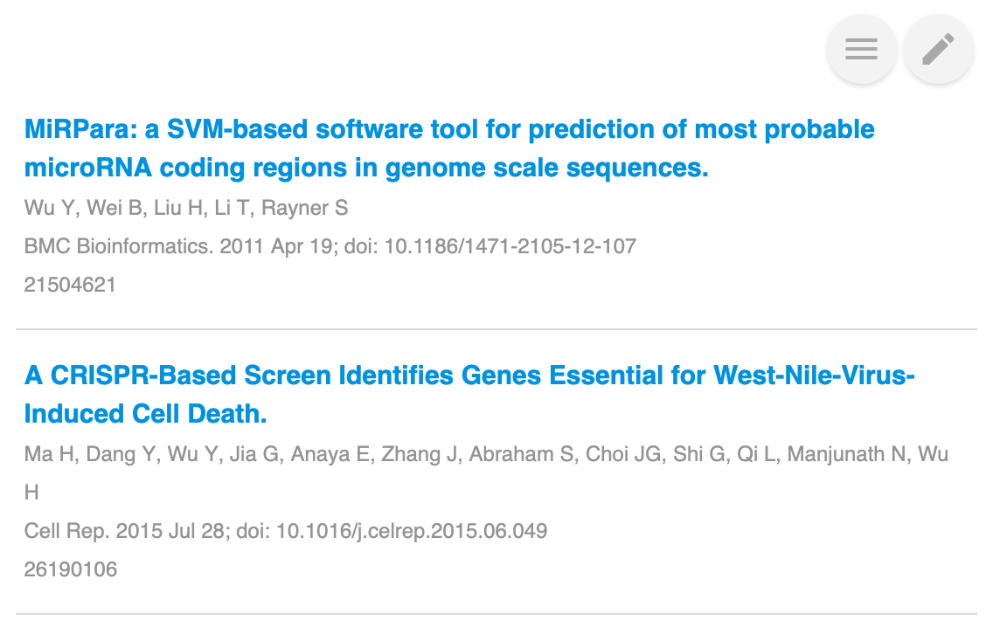

# PubMed

## Overview

[PubMed](https://en.wikipedia.org/wiki/PubMed) is a free search engine accessing primarily the MEDLINE database of references and abstracts on life sciences and biomedical topics. The United States National Library of Medicine at the National Institutes of Health maintains the database as part of the Entrez system of information retrieval.

While servicing to document the new scientific data, [Labii ELN & LIMS](https://www.labii.com) can also help you manage the published papers from PubMed.

[Labii ELN & LIMS](https://www.labii.com/) currently provides these PubMed widgets:

| Widget | Type | Description |
| :--- | :--- | :--- |
| PMID | Column | Store PMID and sync other fields with PubMed |
| PubMed Abstract | Section | Display the abstract of a PMID |
| PubMed Citation | Section | Display summary of PMIDs |

## PMID

**PMID** is a Column type widget to store PubMed id and sync other fields with PubMed.

PMID have to work with other fields, here are the fields that needed:

| Column | Widget | Description |
| :--- | :--- | :--- |
| PMID | PMID | PubMed id |
| journal | Text | Journal title |
| volume | Number | Journal volume |
| issue | Number | Journal issue |
| pages | Text | Journal pages |
| authors | Text | The authors |
| pubdate | Text | Published date |
| pmc | Text | PMC id |
| doi | Text | DOI |
| full\_text\_link | Text | Link of full text |


Note: The name of PMID have to be named as **PMID**. 


### Sync column data

The value of above fields can be updated directly. To do that, 1\) update the value of PMID, 2\) click the the sync icon next to the PMID.


**Note**: Error message will be generated if the PMID is not correct. 


The title of paper will be updated in the name field, no additional settings needed. 

For all other columns, if the column is added in the table settings, the field will be updated, otherwise, it will be ignored.

## PubMed Abstract

**PubMed Abstract** is a section widget to display the abstract of a paper. It will first check whether the abstract is downloaded, if not, the widget will download the save the abstract in the database automatically.

**Requirement:**

This widget reply on the **PMID** widget to query the abstract. If the field is missing, an error message will be provided.

Click "Update Abstract" to get a new version of the abstract.

## PubMed Citation

**PubMed Citation** is a section widget to display summary for multiple PMIDs. It can be inserted into any experiments or protocols, and it does not reply on **PMID** widget.

To add a list of PMIDs, click the _edit_ icon and paste a list of PMIDs separated by "," or one PMID per line.

Once submitted, the summary will be displayed:

## To-do

There are more PubMed related widgets we are going to develop. Please contacts help@labii.com to provide your suggestions.

* [ ] Request full text
* [ ] PubMed Summary
* [ ] PubMed Full Text

