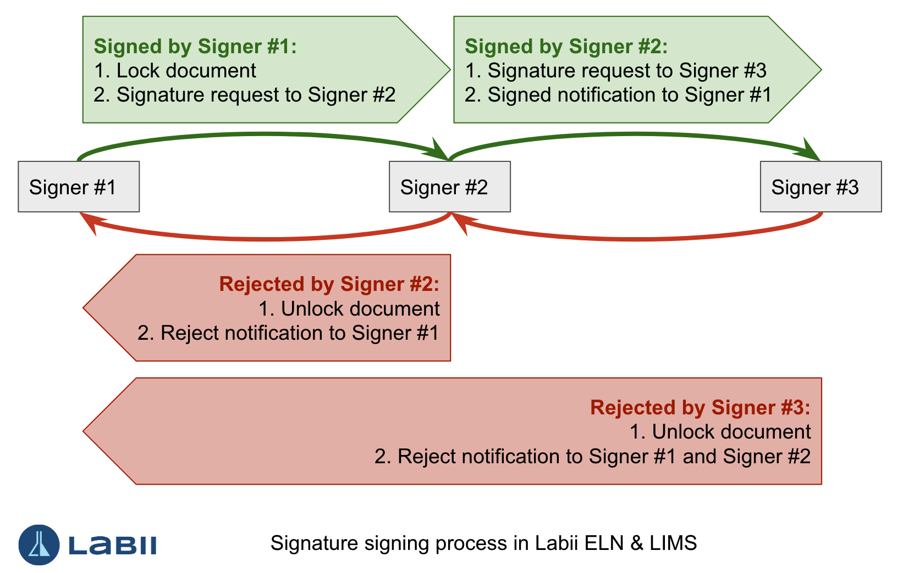
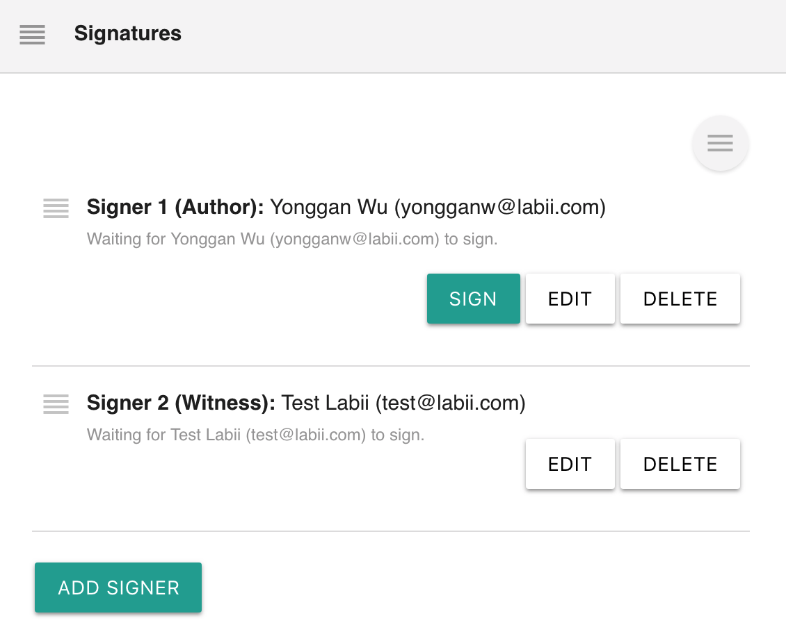
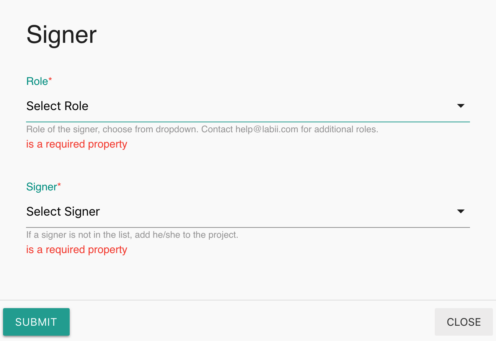
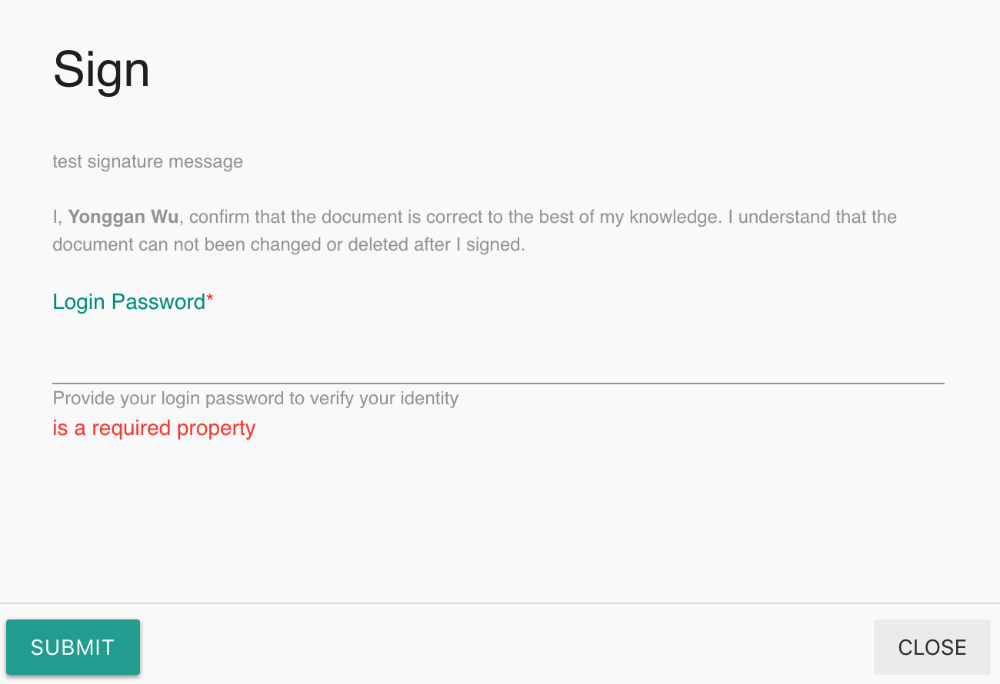
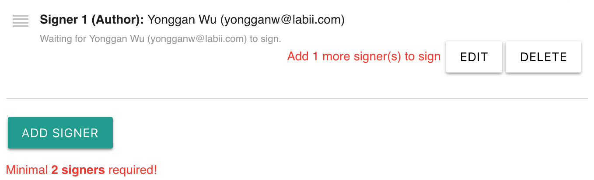
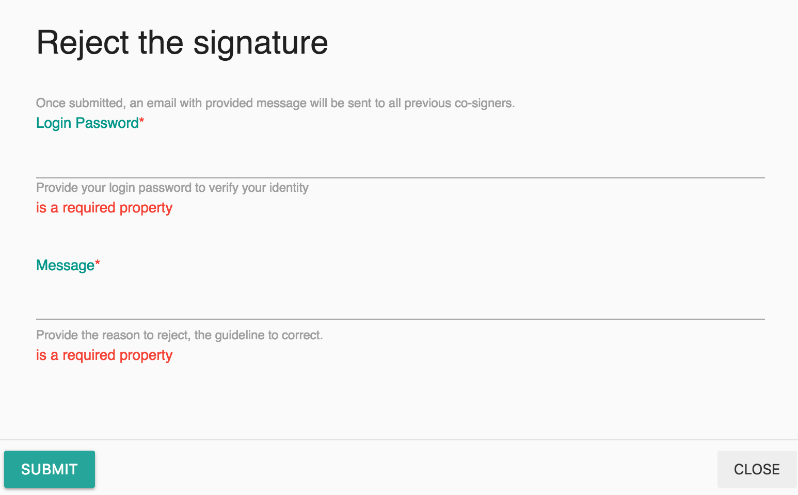

# Signature

## Overview

An electronic signature, or e-signature, refers to data in electronic form, which is logically associated with other data in electronic form and which is used by the signatory to sign. 

[Labii ELN & LIMS \(Electronic Lab Notebook and Laboratory Information Management System\)](https://www.labii.com/) is designed to fully matches the requirement of regulation organizations. Specifically:

* Once signed, the document will be locked from editing.
* The e-signature contains the document, date time, and user information.
* Multiple users can be configured with various roles.
* The signature message can be customized with organization metadata **SIGNATURE\_MESSAGE**
* User's login password is required to avoid unauthorized signatures.
* Signatures are signed in order. Later signers have permission to revoke previous signatures

### Signature

The signature at Labii contains the information of **the record, user, date stamp**. A typical signature looks like this:

`ZlhORGUxODRlMGUxYzMyZTRhNzA0MTRkNTNmNzA2NmQxZmRlX1B2NEMweDcweDFFM1NzSkVzaUdJRTI_`

### Signing process

1. The first signer signed the document. The document will be locked from editing, and the second signer receive signature requirement via email.
2. The second signer has the option to sign or reject. 
   1. If signed, the first signer will receive a confirmation email. The third signer will receive a signature request email.
   2. If rejected, a message has to be provided. The first signer will receive the reject information. Once correct, the first signer has to sign the document again.
3. The process will continues till all signer signed the document.

### Widgets

[Labii ELN and LIMS](https://www.labii.com/) currently provides these widgets:

| Widget | Type | Description |
| :--- | :--- | :--- |
| Signatures | Section | Identification in authorizing this document |
| Double Signatures | Section | Minimal two signers required |
| Triple Signatures | Section | Minimal three signers required |

## Signature Widgets

Signers are listed in order. Particular, each signer is displayed as:

`[No. of signer] ([Role]): [Signer Name]`

### Add a signer

Click "**Add Signer**" button to add a new signer.


Note: One user can only be added once.



Note: New signers can be added even the record is signed and locked.


### Edit a signer

Click "**Edit**" button next to a signer to edit the signer. The edit interface is same to the add signer interface.


Note: Unsigned signers can still be edit even the record is signed and locked.


### Delete a signer

Click "**Delete**" button next to a signer to delete a signer. Only the unsigned the signers can be deleted.

### Change signers order

The order of signers can be changed via drag the handle of a signer to a different position. The order of signers can only be changed when the record is not yet signed.

### Sign a record

Click the "**Sign**" button to sign the record. A password needs to be provided to sign the record.


**Double Signatures** requires minimal 2 signers, **Triple Signatures** requires 3 signers. If not enough signers are added, the "**Sign**" button is hidden. 


### Reject signature

Click "**Reject**" to reject signature. The later signers have the option to reject previous signatures. A reject message has to be included.

### Custom signature message

A custom message can be displayed to signers to remind them to perform certain checks. The signature message can be added via metadata **SIGNATURE\_MESSAGE.** [Simply add a label of "SIGNATURE\_MESSAGE" to organization metadata](../settings/organization-detail.md#metadata). 

### Save signers

If you have the same co-signers all the time \(or most of the time\), there is a quick way to auto load all signers. 

[Click the "**Menu**" button and then choose "**Save as my default**"](../eln-and-lims/detail-view.md#save-default-section-data).  Please check the link for more details.

## Make changes after signed

Once signed, the record is locked from editing. 

### Changes to the record

If not all signers are signed, ask the next signer to [reject the signing](signature.md#reject-signature). Once rejected, the record will go back to editing mode. Further changes can be made.

If all signers have signed, the only way is to [duplicate the record](../eln-and-lims/detail-view.md#duplicate), make necessary changes, and resign the record.

### Changes to the signers

No changes can be made to signed signers. Unsigned signers can be edited or deleted. 

More signers can be added.

