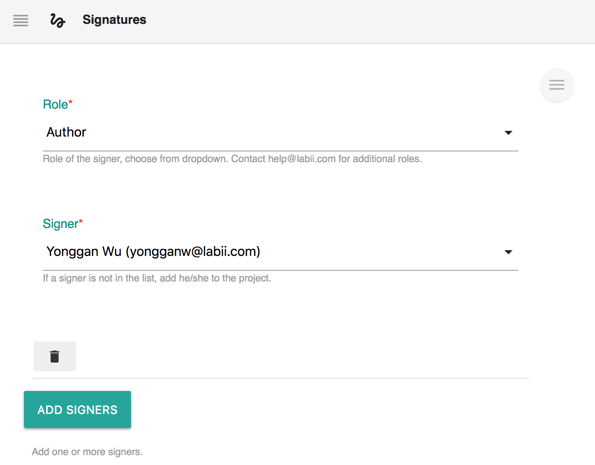
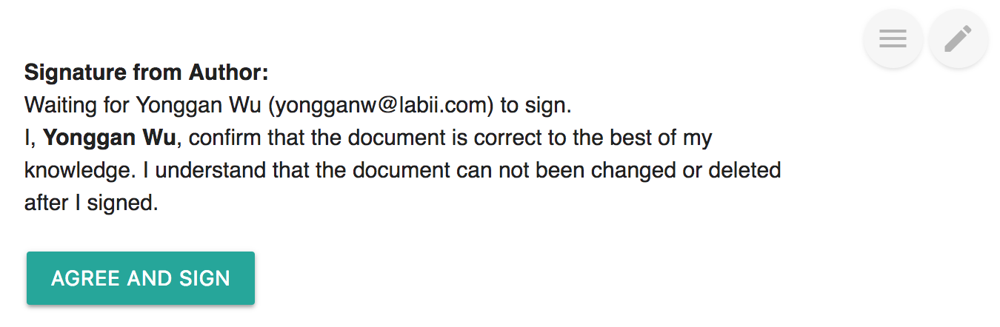
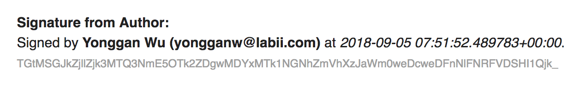
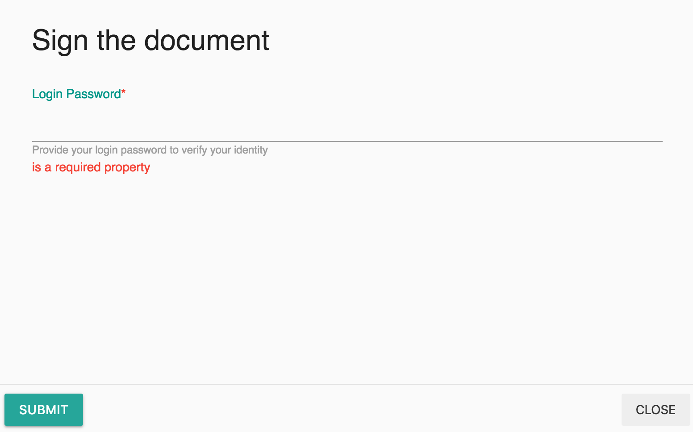

# Signature

## Overview

An electronic signature, or e-signature, refers to data in electronic form, which is logically associated with other data in electronic form and which is used by the signatory to sign. 

[Labii ELN & LIMS \(Electronic Lab Notebook and Laboratory Information Management System\)](https://www.labii.com/) is designed to fully matches the requirement of regulation organizations. Specifically:

* Once signed, the document will be locked.
* The e-signature contains the document, date time, and user information.
* Multiple users can be configured with various roles.
* The signature message can be customized with organization metadata **SIGNATURE\_MESSAGE**
* User's login password is required to avoid unauthorized signatures.
* Signatures are signed in order. Later signers have permission to revoke previous signatures

#### Signing process:

1. The first signer signed the document. The document will be locked from editing, and the second signer receive signature requirement via email.
2. The second signer has option to sign or reject. 
   1. If signed, the first signer will receive a confirmation email. The third signer will receive signature request email.
   2. If rejected, a message have to be provided. The first signer will receive the reject information. Once correct, the first signer have to sign the document again.
3. The process will continues till all signer signed the document.

[Labii ELN and LIMS](https://www.labii.com/) currently provides these widgets:

| Widget | Type | Description |
| :--- | :--- | :--- |
| Signatures | Section | Identification in authorizing this document |
| Double Signatures | Section | Minimal two signers required |

## Configuration

Before using the widget, the signer information have to be configured first. Click the "**Edit**" button to configure.

Click "**Add Signers**" to add more signers.


For **Signatures**, the configure interface will be open directly if no signers are added.

For **Double Signatures**, the configure interface will be open directly if less than two signers are added.


## Interface

Once configured, the document is ready to sign. Additional information can be provides to guide the signers to review the document before signing. These information can be configured in the metadata of **SIGNATURE\_MESSAGE**.

Once signed, the signature of the signer will be displayed and the Sign button will be transferred to next signer.

## Sign

Click the button to sign. The login password is required.

## Reject

The later signers have option to reject previous signatures. A reject message has to be included.

