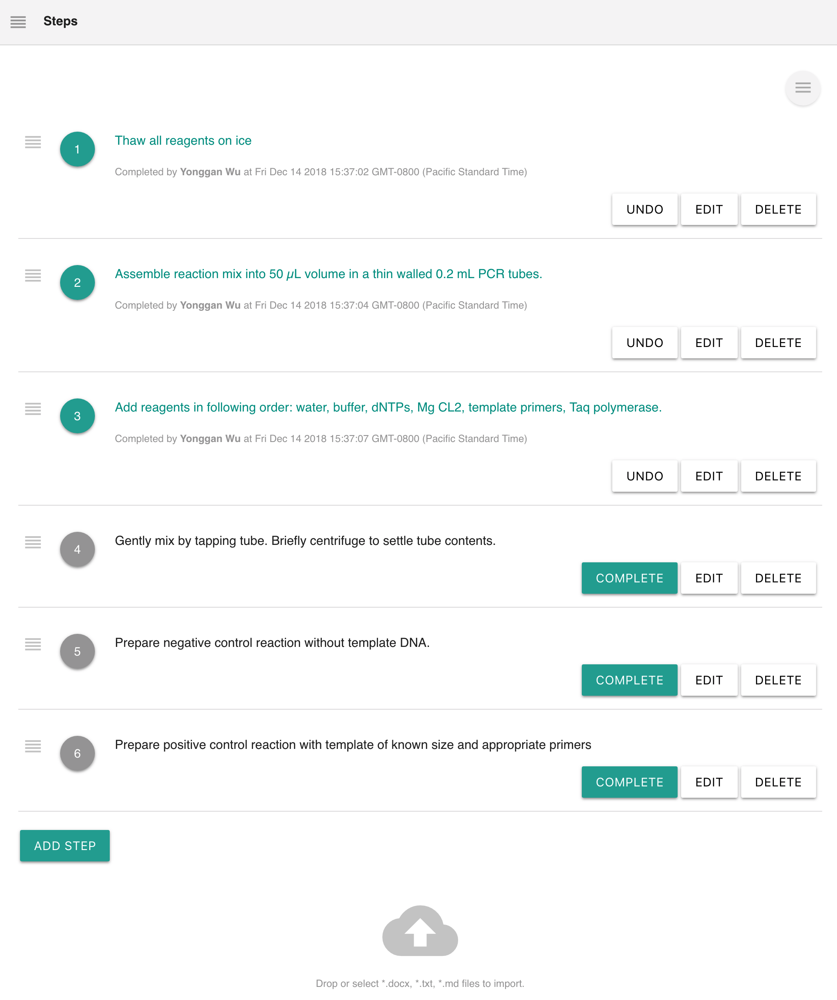
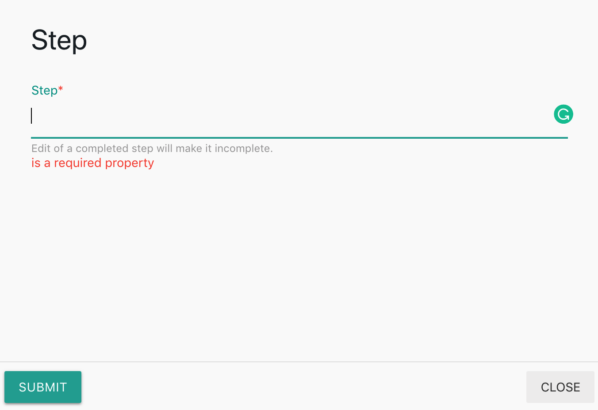

# Steps

## Overview

The steps of a protocol are critical, especially for [Electronic Lab Notebook](https://www.labii.com). The steps can be displayed in many ways in [Labii ELN & LIMS](https://www.labii.com), specifically:

* Use [Plain Text ](text.md#plain-text)or [Rich Text](text.md#rich-text) to display text format of steps.
* Use Section Citation to display the steps from a protocol.
* Use [File](file.md#overview), [Files](file.md#overview) to display the steps from an external word or pdf file.
* Last, but not least, use the **Steps** widget to track the complete status of each step.

Labii ELN & LIMS currently provides these widgets:

| Widget | Type | Description |
| :--- | :--- | :--- |
| Steps | Section | Tracking status of each step. |
| Section Citation | Section | Display section data from one other record |

## Steps

Steps is a new widget designed to track the status of each step. User has the option to mark which step has been completed. The widget will also capture who and when does a step complete.

Each step contains 1\) a step order, 2\) the step content, 3\) action buttons.

### Add a new step

Click **Add Step** to add a new step. Fill in the step content and click **Submit**.

### Edit a step

Click **Edit** button next to a step to edit the content of the step. The interface is same to the [Add steps](steps.md#add-new-step). 

### Delete a step

Click **Delete** button next to a step to delete the step.

### Change step order

Drag and drop the drag handle at the front of step index to change the order of steps.

### Complete a step

Click the **Complete** button to complete the step.

When a step is completed, the color will change to _teal_. And the timestamp and user information will be added to the end of the step.

### Incomplete a step

Click the **Undo** button to incomplete a step.

### Load steps from an external file

The steps can be loaded directly from a \*.txt, \*.docx, or \*.md file. Just drag and drop a file to the Cloud area or Click the cloud icon to select a file. All steps will be loaded in order.

## Section Citation

