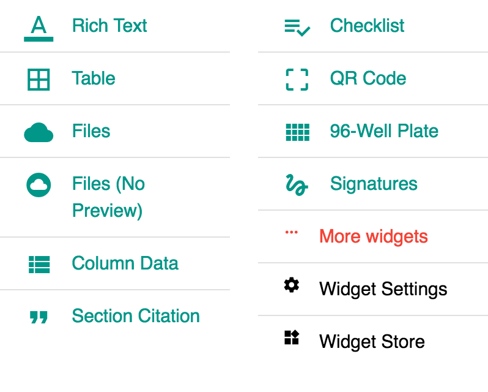
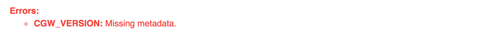

# Summary

## About

[The widgets at Labii ELN & LIMS is a stand-alone function to edit or process certain peace of data](https://blog.labii.com/2018/01/extend-usability-of-your-labii-eln-via-widgets.html). Labii as a  Electronic Lab Notebook \(ELN\) and Laboratory Information Management System \(LIMS\) service provider, introduced widgets to meet the specific requirements of each research lab.

### Types

Two types of widgets are available in [Labii ELN & LIMS](https://www.labii.com):

* **Section**: Widgets used in a section to provide comprehensive function to process the data. For example, the **Rich Text** widget to insert/edit text of a record.
* **Column**: Widgets used as a column type to provide simple function to process the data for a cell. For example, **Text** widget to define the column can only take text data.

### Attributions

* `allow_multiple=true/false`, if true, the same widget can be inserted multiple times into a record; if false, only one widget is allow for a record.
* `is_readonly=true/false`, if true, the widget provides readonly data and can still added into a locked record to display the hidden data; if false, the widget is not available for locked records.
* `is_public=true/false`, if true, the widget is available to all accounts in Labii; if false, the widget is specifically developed for some organizations and only available to those organizations. 
* `is_archived=true/false`,  if true, the widget is not available to use.
* `metadata_labels`, list of metadata labels that required for the widget. The metadata can be set at the organization, project or record level. [See details here](summary.md#metadata-labels). 

## Enable Widgets

Administrators have permission to control what widgets to use for the users. [See details here](../settings/widgets.md). 

## Custom Widget Menu

The widget menu is customizable in detail view. Include those commonly used widgets in the menu can speed up your documentation process. [See detail here](../settings/widgets.md). 

> 

## Metadata Labels

The specific variables can be provided via adding metadata to your **organization**, **project**, or **record**. The metadata labels is defined in the `metadata_labels` field of widget. If these field is empty, no metadata need to set up.

The metadata is specific in order:

* **organization**, add the metadata to organization level if you want the metadata available to all users in  the organization. See [here](../settings/organization-detail.md#metadata) for more details. 
* **project**, add the metadata to project level if you want the metadata available to the users in the project. Other users from other project could not use the metadata. The metadata at the project level will overwrite the metadata at the organization level. 
* **record/row**, add the metadata to record level. This metadata can only been used for this record. The metadata at record level will overwrite the same metadata at the project or organization level.


The priority of metadata: record &gt; project &gt; organization


## Errors

The conditions will be checked before the loading of widget. The errors have to be fixed to use the widget.

**Error types:**

* **Missing metadata:** The required metadata does not provided. To solve this error, added the missing metadata to organization, project or record.

## Categories

Here is an overview of all widgets base on their functions.

### Office

* [Table](table.md)
  * Table
* [Text](text.md)
  * Plain Text
  * Rich Text
* [File](file.md)
  * File
  * Files
  * Files \(No Preview\)

### Regulation

* [Signature](signature.md)
  * Signatures
  * Double Signatures
* Activity
  * Activity
* Version Control
  * Version

### LIMS

* [Barcode](barcode.md)
  * QRCode
* [Foreign Key Relationships](foreign-key-relationships.md)
  * Backlink
  * Section Citation

### Biology

* [Microplate](microplate.md)
  * 96-Well Plate
  * 384-Well Plate
* [Plasmid](plasmid.md)
  * Plasmid Viewer
  * Plasmid Editor

### Column Widgets

* Basic
  * Text
  * Number
  * Date
  * Select
  * MultiSelect
  * Boolean
  * ForeignKey
  * ForeignKeys
  * Member
  * Members

