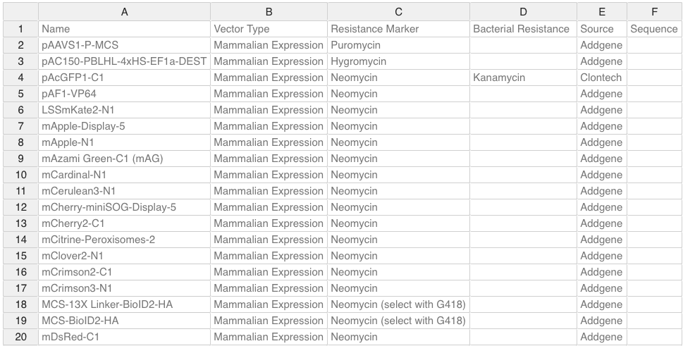

# Table

## Overview

[Labii ELN & LIMS](https://www.labii.com/) use Table widget to provide Excel like functions to Electronic Lab Notebook.

## View & Edit

The view interface and edit interface are identical except value can be changed at the Edit mode.

## Formula support

Labii ELN & LIMS supports _Formulas_ to process formula expressions defined in the provided data. 

#### **Features:**

* Any numbers, negative and positive as float or integer;
* Arithmetic operations such as: `+`, `-`, `/`, `*`, `%`, `^`;
* Logical operations such as: `AND()`, `OR()`, `NOT()`, `XOR()`;
* Comparison operations such as: `=`, `>`, `>=`, `<`, `<=`, `<>`;
* All JavaScript Math constants such as: `PI()`, `E()`, `LN10()`, `LN2()`, `LOG10E()`, `LOG2E()`, `SQRT1_2()`, `SQRT2()`;
* Error handling: `#DIV/0!`, `#ERROR!`, `#VALUE!`, `#REF!`, `#NAME?`, `#N/A`, `#NUM!`;
* String operations such as: `&` \(concatenation eq. `=-(2&5)` will return `-25`\);
* Relative and absolute cell references such as: `A1`, `$A1`, `A$1`, `$A$1`;
* Build-in variables such as: `TRUE`, `FALSE`, `NULL`;
* Custom variables;
* Nested functions;
* Dynamic updates.

**Known limitations:**

* Not working with filtering and column sorting;
* Not working with trimming rows.

## Data import

The table widget supports data import \*.xlsx, \*.tsv, \*.csv. Simply drag and drop a file to the widget and the content of the file will be loaded into the table.

