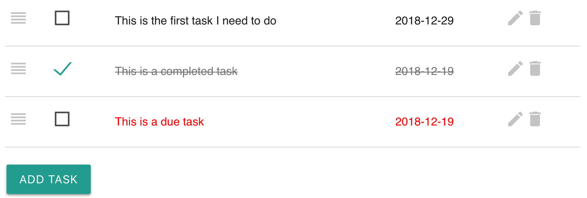
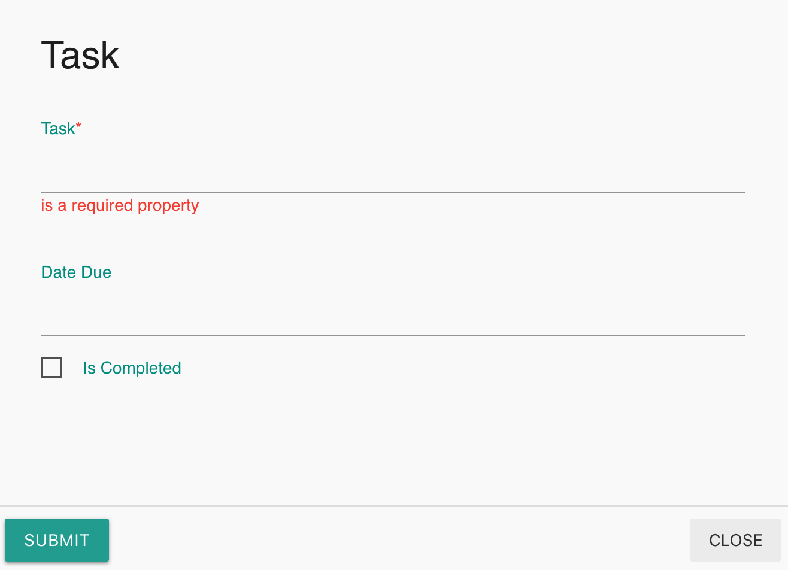

# Tasks

## Overview

Many people keep a list of things to do — on paper, in a spreadsheet, or in an app. Labii ELN & LIMS provides task widgets to simplifier the task tracking process.

Labii ELN & LIMS currently provides these widgets:

| Widget | Type | Description |
| :--- | :--- | :--- |
| Tasks | Section | Manage a list of things to do |

## Tasks

The tasks are displayed in a list:

### Add a task

Tasks can be added via clicking button "**Add Task**".

### Edit a task

Click the **edit** icon next to a task to edit a task.

### Delete a task

Click the **delete** icon next to a task to delete a task.

### Complete a task

Click the checkbox of a task to complete the task, click the checkbox again to undo the task. Due tasks are showing in red color.

### Change order

Drag the handle in front of a task to change task order.

