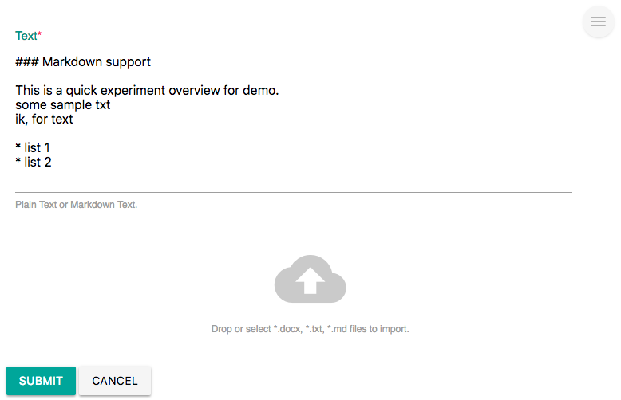
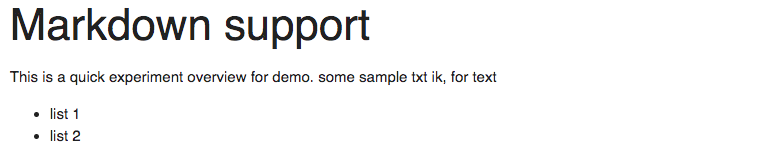
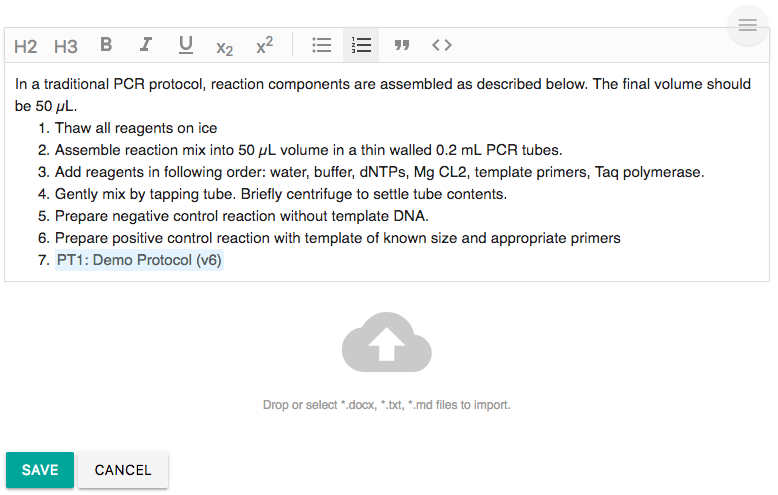

# Text

## Overview

Use Text Widgets to change text data. Text editor is widely used in Electronic Lab Notebook. 

[Labii ELN & LIMS](https://www.labii.com) currently provides these Text widgets:

| Widget | Type | Description |
| :--- | :--- | :--- |
| Plain Text | Section | Add plain text, with markdown support |
| Rich Text | Section | Add/Edit text with WYSIWYG Text Editor |

## Plain Text

The Plain Text widget is more like a text box. It is simple, light. It also support [markdown](https://en.wikipedia.org/wiki/Markdown). Plain Text is good for those fields accepts simple text data and for those developers prefer markdown.

Click the 'edit' icon to edit the text. Labii also supports file content extraction via drag and drop \*.docx, \*.txt, or \*.md files to the 'cloud' icon.

Once submitted, the markdown will be parsed directly:

## Rich Text

Rich Text widget is design for those people familiar with MicroSoft Word. It [WYSIWYG](https://en.wikipedia.org/wiki/WYSIWYG). 

Click the 'edit' icon to start editing. Use the button in the menu to change the formatting of the text.

Just like Plain Text, files \(\*.docx, \*.txt, or \*.md\) can be drag and drop to the 'cloud' area to extract the content. 

[Mention](https://goingsocial.ca/using-the-mention-function-on-twitter/) is also supported in Rich Text widget. Type `@`, and a list of records will show up. You can also type a few words to search. Once selected, the mentioned item is clickable.

